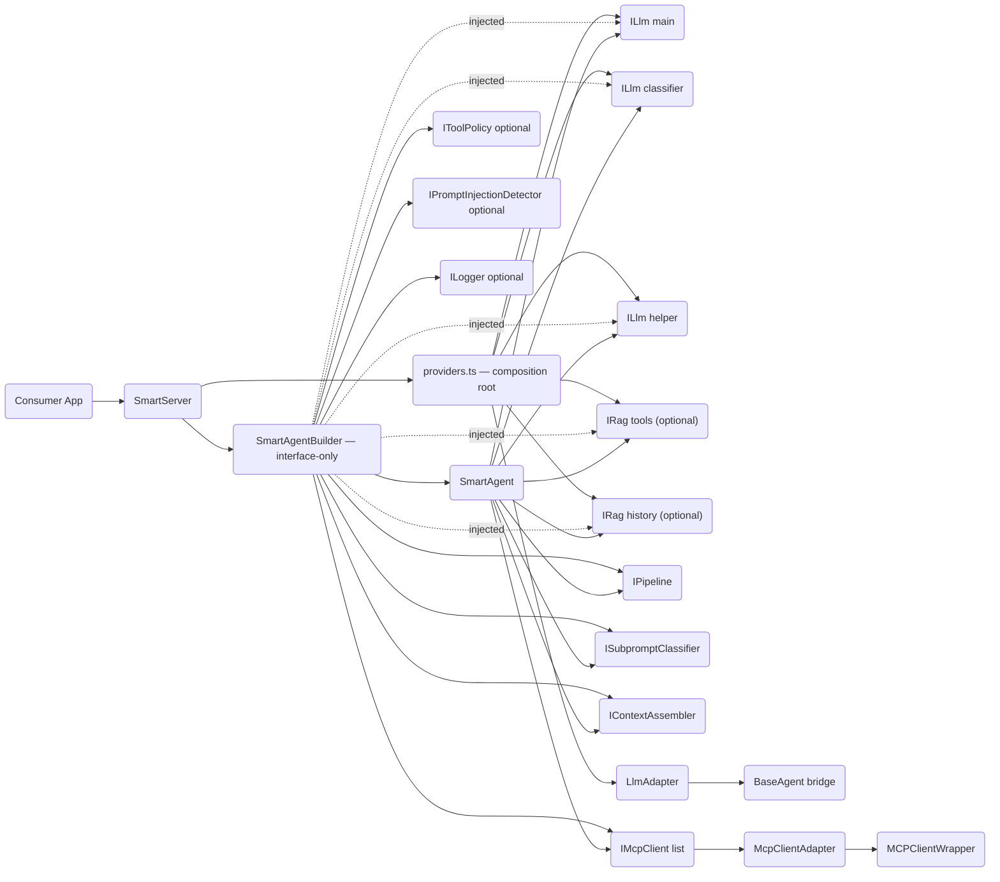
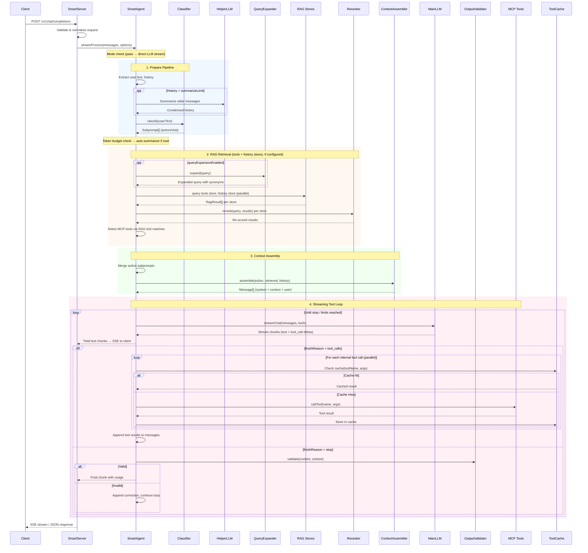

# Architecture

## Scope

`@mcp-abap-adt/llm-agent` currently contains two layers:

1. **Legacy core (`src/agents`, `src/llm-providers`, `src/mcp`)**
- Provider-specific agent implementations and direct MCP integration.
- Kept for backward compatibility and adapter reuse.

2. **Smart Agent stack (`src/smart-agent`)**
- Orchestrated pipeline with classification, RAG retrieval, policy checks, MCP execution loop, and OpenAI-compatible HTTP serving.
- This is the primary runtime architecture for new work.

## Runtime Topology (Smart Stack)

```text
Client (OpenAI-compatible)
  -> SmartServer (HTTP/SSE) — composition root
     -> providers.ts (resolves config → concrete ILlm, IRag, IEmbedder)
     -> SmartAgentBuilder (interface-only wiring, no provider knowledge)
        -> SmartAgent (orchestration loop)
           -> ILlm (main/helper/classifier via adapters)
           -> IPipeline (request orchestration — DefaultPipeline or consumer-defined)
           -> IRag stores (tools / history — consumer-defined)
           -> IMcpClient[] (one or many MCP endpoints)
           -> Policy guards (tool policy + injection detector)
```

### Dependency Graph (Detailed)



## Inbound API Adapter Layer

SmartServer supports multiple inbound API protocols via `ILlmApiAdapter`. Each adapter is a stateless singleton registered by name; the server selects the adapter based on the HTTP route.

```text
[Client]
  → POST /v1/chat/completions   → OpenAiApiAdapter   ──┐
  → POST /v1/messages           → AnthropicApiAdapter ──┤
                                                         ▼
                                                    SmartAgent
                                                         │
                                                         ▼
                                                       ILlm  → Provider
```

Adapter responsibilities:
- `normalizeRequest()` — parse the protocol-specific body into internal `NormalizedRequest` (messages + options)
- `transformStream()` — convert the agent's `AsyncIterable<LlmStreamChunk>` into `AsyncIterable<ApiSseEvent>` with protocol-specific SSE event names and data shapes
- `formatResult()` — format a completed response for the wire
- `formatError()` — optional; format errors into the protocol's error envelope

Custom adapters are registered via `builder.withApiAdapter()`, the `apiAdapters` SmartServer config field, or the `apiAdapters` plugin export. Set `disableBuiltInAdapters: true` in SmartServer config to suppress the built-in OpenAI and Anthropic adapters.

Files:
- `src/smart-agent/interfaces/api-adapter.ts` — `ILlmApiAdapter`, `ApiRequestContext`, `ApiSseEvent`, `AdapterValidationError`
- `src/smart-agent/api-adapters/openai-adapter.ts` — `OpenAiApiAdapter`
- `src/smart-agent/api-adapters/anthropic-adapter.ts` — `AnthropicApiAdapter`

## Embeddable Component Contract (No YAML)

For library embedding, YAML is not required. YAML is only a CLI/runtime convenience for `llm-agent`.

Primary embeddable surfaces:
- package export `@mcp-abap-adt/llm-agent/smart-server` -> `SmartServer`
- package export `@mcp-abap-adt/llm-agent/testing` -> deterministic test doubles for consumer integration tests

Minimal programmatic integration:

```ts
import { SmartServer } from '@mcp-abap-adt/llm-agent/smart-server';

const server = new SmartServer({
  llm: {
    apiKey: process.env.DEEPSEEK_API_KEY!,
    model: 'deepseek-chat',
  },
  mode: 'smart',
});

const handle = await server.start();
// handle.port, handle.requestLogger.getSummary(), handle.close()
```

`SmartServer` public contract:
- input: `SmartServerConfig`
- output: `Promise<SmartServerHandle>`
- lifecycle: `start()` -> `{ port, requestLogger, close }`
- protocol: OpenAI-compatible `/v1/chat/completions` (JSON + SSE)

## Request Processing Flow



### Key decision points

1. **Mode selection** — `pass` skips the entire pipeline and streams directly from LLM. `smart` runs full orchestration. `hard` forces MCP-only tools (no external tools).
2. **RAG retrieval** — When `tools` or `history` RAG stores are configured, they are queried in parallel. Tool selection uses `tools` store results. History retrieval uses `history` store results. Both are optional.
3. **Tool routing** — Tool calls from LLM are classified as: internal (MCP), external (client-provided), hallucinated (unknown), or blocked (temporarily unavailable). Each category has distinct handling.
4. **Loop termination** — The tool loop exits on: `finishReason: stop`, `maxIterations` reached, `maxToolCalls` exhausted, abort signal, or external tool call delegation.
5. **onBeforeStream hook** — If an `onBeforeStream` hook is configured, the final response content is passed through it before streaming to the caller (e.g., for reformatting or post-processing).

## Request Lifecycle

### 1. Server Boundary

Entry points:
- `src/smart-agent/smart-server.ts` (`SmartServer`)
- `src/smart-agent/server.ts` (`SmartAgentServer`, lightweight/legacy test server)

`SmartServer` responsibilities:
- Parse/validate OpenAI-compatible requests (`/v1/chat/completions`).
- Normalize message content blocks into text.
- Normalize external tool definitions with `normalizeExternalTools()`.
- Emit SSE chunks in OpenAI-compatible sequence.
- Build and hold `SmartAgent` via `SmartAgentBuilder`.

### 2. Orchestration Core

Main implementation:
- `src/smart-agent/agent.ts` (`SmartAgent`)

SmartAgent delegates request orchestration to the injected `IPipeline`:

1. Pre-flight and timeout/abort merging.
2. `pipeline.initialize(deps)` is called once at build time.
3. Per request: `pipeline.execute(input, history, options, yieldChunk)`.
4. `DefaultPipeline` (built-in): classify → summarize → RAG query (tools + history) → rerank → skill-select → tool-select → assemble → tool-loop → history-upsert.
5. Consumer pipelines can replace any or all stages.

See [Pipeline Architecture](#pipeline-architecture) for details.

### 3. LLM Integration

Abstractions:
- `src/smart-agent/interfaces/llm.ts`
- `src/smart-agent/adapters/llm-adapter.ts`

`LlmAdapter` bridges legacy `BaseAgent` implementations to smart-agent `ILlm`.
Concrete provider resolution is centralized in:
- `src/smart-agent/providers.ts` — the only module that imports concrete LLM providers

Pipeline config types (`deepseek`, `openai`, `anthropic`, `sap-ai-sdk`) are defined in:
- `src/smart-agent/pipeline.ts` (types only, no provider logic)

### 4. RAG Layer

Core contracts:
- `src/smart-agent/interfaces/rag.ts` — `IEmbedder`, `IRag`, `EmbedderFactory`

Implementations:
- `src/smart-agent/rag/vector-rag.ts`
- `src/smart-agent/rag/in-memory-rag.ts`
- `src/smart-agent/rag/ollama-rag.ts`
- `src/smart-agent/rag/openai-embedder.ts`
- `src/smart-agent/rag/qdrant-rag.ts`
- `src/smart-agent/rag/embedder-factories.ts` — built-in embedder factories (`ollama`, `openai`)

Embedders are injectable via DI:
- Programmatic: `SmartServer({ embedder: myEmbedder })`
- YAML-driven: register custom factory via `SmartServer({ embedderFactories: { 'my-embedder': fn } })`, then reference in YAML as `embedder: my-embedder`

Stores are consumer-defined. The built-in DefaultPipeline recognizes two store keys:
- `tools` (tool/skill schemas for RAG-based tool selection)
- `history` (semantic conversation history / long-term memory)

Both are optional. Consumer pipelines may define additional stores with arbitrary keys — the
DefaultPipeline simply queries the stores it receives; it does not hard-code any store names.

The builder selects the `tools` store by key for tool/skill vectorization at startup. If no `tools` store is provided, tool vectorization is skipped and all MCP tools are included in every request context.

**Idempotent upsert contract:** when `metadata.id` is provided, implementations MUST treat it as an idempotent key — repeated upserts with the same id replace the previous record instead of creating duplicates. All built-in implementations (`QdrantRag`, `InMemoryRag`, `VectorRag`) enforce this.

### 5. MCP Layer

- Smart stack uses `IMcpClient` abstraction.
- Default adapter wraps `MCPClientWrapper` from `src/mcp/client.ts`.
- Supports multiple MCP servers simultaneously via builder/pipeline config.
- Health checks use lightweight MCP ping (`MCPClientWrapper.ping()`) instead of `listTools()`, avoiding unnecessary tool catalog requests when health is polled frequently.
- **Reconnection** — `IMcpConnectionStrategy` is an optional dependency injected via `builder.withMcpConnectionStrategy()`. It is called at the start of each request to resolve the current set of live MCP clients. Built-in strategies: `NoopConnectionStrategy` (pass-through, default behaviour), `LazyConnectionStrategy` (reconnects on demand with cooldown), `PeriodicConnectionStrategy` (reconnects on a background timer).

### 6. Skills Layer

Skills are reusable instruction packages (SKILL.md files) that inject context into the LLM system prompt. Unlike MCP tools (which provide actions), skills provide guidelines, domain knowledge, and behavioral instructions.

**Startup flow:**
- `SmartAgentBuilder.build()` calls `skillManager.listSkills()`
- Each skill is vectorized into facts RAG: `"Skill: <name>\n<description>"` with metadata `{ id: "skill:<name>" }`
- Skills coexist with tools in the same facts store

**Per-request flow:**
- `skill-select` handler extracts `skill:*` IDs from RAG results
- If none found (skills drowned out by tools), does a dedicated fallback RAG query
- Loads content via `ISkill.getContent()` with `$ARGUMENTS` / `$CLAUDE_SKILL_DIR` substitution
- `assemble` handler appends skill content as `## Active Skills` section in system message

**Three built-in managers:**

| Manager | Discovery paths | Vendor logic |
|---------|----------------|--------------|
| `ClaudeSkillManager` | `~/.claude/skills/` + `<project>/.claude/skills/` | Maps kebab-case frontmatter (`disable-model-invocation` → `disableModelInvocation`) |
| `CodexSkillManager` | `~/.agents/skills/` + `<project>/.agents/skills/` | Parses optional `agents/openai.yaml` into meta extensions |
| `FileSystemSkillManager` | Configurable `dirs[]` | None — simplest variant |

**SKILL.md format:**
```markdown
---
name: skill-name
description: One-line description (used for RAG matching)
user-invocable: true
argument-hint: "<argument description>"
allowed-tools:
  - tool_name
---

Skill instructions here. Use $ARGUMENTS for invocation args
and $CLAUDE_SKILL_DIR for the skill directory path.
```

**Configuration (YAML):**
```yaml
skills:
  type: claude          # claude | codex | filesystem
  dirs:                 # filesystem type only
    - ./my-skills
  projectRoot: .        # claude/codex type, defaults to cwd
```

**Configuration (programmatic):**
```ts
builder.withSkillManager(new ClaudeSkillManager(process.cwd()));
```

## Internal Interfaces and Default Implementations

| Interface | Role | Default implementation |
|---|---|---|
| `ILlm` | Chat/stream model abstraction used by `SmartAgent` | `RetryLlm(CircuitBreakerLlm(LlmAdapter(BaseAgent)))` via `providers.ts` + `builder.ts` |
| `IRequestLogger` | Per-model, per-component usage tracking | `DefaultRequestLogger` (auto-created by builder) |
| `IModelProvider` | Model discovery and per-request model selection | `LlmAdapter` (auto-detected from `mainLlm`) |
| `IEmbedder` | Text → vector embedding | `OllamaEmbedder`, `OpenAiEmbedder`, or custom via DI |
| `ISubpromptClassifier` | Intent/subprompt decomposition | `LlmClassifier` |
| `IContextAssembler` | Builds final model context window | `ContextAssembler` |
| `IRag` (`tools`/`history` + consumer-defined) | Retrieval and memory stores | `VectorRag`, `QdrantRag`, `OllamaRag`, or `InMemoryRag` |
| `IMcpClient` | Tool catalog and tool execution | `McpClientAdapter(MCPClientWrapper)` |
| `IMcpConnectionStrategy` | Per-request MCP reconnection / health recovery | `NoopConnectionStrategy` (no-op, default); `LazyConnectionStrategy` / `PeriodicConnectionStrategy` for auto-reconnect |
| `IToolPolicy` | Allow/deny policy checks | `ToolPolicyGuard` (optional) |
| `IPromptInjectionDetector` | Injection heuristics | `HeuristicInjectionDetector` (optional) |
| `ISkillManager` | Skill discovery and content loading | `ClaudeSkillManager`, `CodexSkillManager`, `FileSystemSkillManager` (optional) |
| `ILogger` | Structured logging sink | `ConsoleLogger` / `SessionLogger` / injected custom logger |

### Separation of concerns

- **`SmartAgentBuilder`** (`src/smart-agent/builder.ts`) — interface-only factory. Accepts `ILlm`, `IRag`, `IMcpClient`, `IPipeline`, etc. Has no knowledge of concrete providers. RAG stores are injected via `.setToolsRag(rag)` and `.setHistoryRag(rag)`; a custom pipeline is injected via `.setPipeline(pipeline)`. Supports an optional `onBeforeStream` hook (set via `.withOnBeforeStream(hook)`) for post-processing the final response before it is streamed to the caller.
- **`providers.ts`** (`src/smart-agent/providers.ts`) — composition root. The only module that imports concrete LLM providers (`DeepSeek`, `OpenAI`, `Anthropic`, `SapCoreAI`) and RAG implementations (`OllamaRag`, `QdrantRag`, etc.). Resolves config → interface instances.
- **`SmartServer`** (`src/smart-agent/smart-server.ts`) — uses `providers.ts` to resolve config, then injects interfaces into `SmartAgentBuilder`.

## Execution Modes

Configured via `SmartAgentConfig.mode` and `SmartServerMode`:

- `smart`:
- Full orchestration (classification + RAG + MCP selection + tool loop).
- Uses external tools when SAP context is not required.

- `hard`:
- SAP/MCP-focused behavior with strict internal tool context.
- External tools are not active in MCP execution loop.

- `pass`:
- Pure passthrough to main LLM stream over provided history/tools.
- Skips orchestration stages.

### Streaming modes

Configured via `SmartAgentConfig.streamMode`:

- `full` (default): all chunks streamed immediately, including intermediate tool loop iterations.
- `final`: intermediate iterations are buffered and discarded; only the final response is streamed. External tool calls and heartbeats are always streamed regardless of mode. Useful for clients (Cline, Goose) that accumulate chunks in their context window.

### Resilience decorators

The `ILlm` chain supports two optional decorators, composed by the builder:

- **`RetryLlm`** — retries transient failures (429, 5xx) with exponential backoff. Configured via `SmartAgentConfig.retry`. For streaming, retries pre-stream failures (zero chunks yielded) on HTTP status codes, and mid-stream failures on configurable error substrings (`retryOnMidStream`). Mid-stream retry replays the entire stream and emits a `reset` chunk so consumers discard accumulated state.
- **`CircuitBreakerLlm`** — fail-fast on sustained failures. Configured via `.withCircuitBreaker()`.

Composition order: `RetryLlm → CircuitBreakerLlm → LlmAdapter`. Retry sits outside the circuit breaker so retry attempts are not counted as separate failures. Token usage is tracked by `IRequestLogger` (injected via builder) rather than a decorator wrapper.

## Protocol Contracts

### Streaming Tool Calls

`LlmStreamChunk.toolCalls` supports both finalized calls and deltas:
- `LlmToolCall`
- `LlmToolCallDelta`

Defined in:
- `src/smart-agent/interfaces/types.ts`

Normalization helpers:
- `src/smart-agent/utils/tool-call-deltas.ts`

This removes unsafe cast chains in critical stream paths and keeps delta assembly explicit.

### External Tool Input Contract

Incoming tool payloads are normalized at boundary:
- `src/smart-agent/utils/external-tools-normalizer.ts`

Accepted shapes:
- internal `LlmTool`
- OpenAI-compatible `{ type: 'function', function: { name, description, parameters } }`-like shape (name/function-derived)

Invalid tool shapes are dropped during normalization instead of flowing into runtime logic as opaque objects.
Validation mode is configurable at request boundary:
- `permissive` (default): invalid client tools are dropped and logged.
- `strict`: request is rejected with `400 invalid_request_error` and a validation code.

### Session Tool Availability Contract

Tools can be protocol-valid but temporarily unavailable in the current environment/session.

- Runtime-unavailable tools are temporarily blocked with TTL in a session-scoped registry.
- Blocked tools are excluded from subsequent LLM tool contexts within the session window.
- The agent emits diagnostics for both block events and blocked-tool interceptions.

## Legitimate vs Suspicious Edge Cases

Decision rule:
- **Legitimate**: allowed by upstream protocol/model behavior, must be handled for compatibility.
- **Suspicious**: produced by local contract gaps, cast-driven parsing, or unclear ownership.

### Legitimate (document + test)

- Fragmented SSE tool arguments across chunks.
- Separate usage tail chunk in SSE.
- Unknown/hallucinated tool names from the model.
- Transport-level MCP failures requiring reconnect/retry/fallback.
- Abort, max-iteration, and max-tool-call safety termination.

### Suspicious (refactor/tighten)

- Runtime dependence on `as unknown as ...` in protocol paths.
- Silent parse degradation without diagnostics.
- Heuristic acceptance of malformed boundary payloads.

Action policy:
- Legitimate -> keep behavior, encode as invariant, test it.
- Suspicious -> tighten contracts/DTOs/validators, add diagnostics, and simplify control flow.

## Key Modules

- `src/smart-agent/agent.ts`: orchestration loop and tool execution control.
- `src/smart-agent/smart-server.ts`: production OpenAI-compatible server.
- `src/smart-agent/builder.ts`: interface-only dependency wiring (no provider knowledge).
- `src/smart-agent/providers.ts`: composition root — concrete provider/embedder/RAG resolution.
- `src/smart-agent/pipeline/default-pipeline.ts`: DefaultPipeline — built-in IPipeline implementation.
- `src/smart-agent/context/context-assembler.ts`: final context construction.
- `src/smart-agent/classifier/llm-classifier.ts`: subprompt decomposition.
- `src/smart-agent/policy/*`: policy guard + injection detector.
- `src/mcp/client.ts`: transport implementation and resilience behavior.

## Repository Structure (High Level)

```text
src/
  agents/                  # legacy/provider-specific agent implementations
  llm-providers/           # provider clients (OpenAI/Anthropic/DeepSeek/SAP Core)
  mcp/                     # MCP transport client wrapper
  smart-agent/             # primary orchestrated architecture
    adapters/              # request/response adapter layer
    api-adapters/          # ILlmApiAdapter implementations (OpenAI, Anthropic)
    cache/                 # tool result caching
    classifier/            # subprompt decomposition (LLM-based)
    config/                # configuration parsing and validation
    context/               # final LLM context assembly
    health/                # health check endpoint
    interfaces/            # all public interfaces (ILlm, IRag, IMcpClient, etc.)
    history/               # session history memory and summarization
    logger/                # structured logging (ConsoleLogger, SessionLogger)
    metrics/               # Prometheus / metrics collection
    otel/                  # OpenTelemetry integration
    pipeline/              # structured YAML pipeline DSL
      handlers/            # built-in stage handler implementations
    plugins/               # plugin system (dynamic stage handler loading)
    policy/                # policy guard + injection detector
    rag/                   # RAG stores, embedders, query expansion
    reranker/              # result re-scoring
    resilience/            # circuit breaker and resilience decorators
    session/               # session management
    skills/                # ISkillManager implementations (Claude, Codex, FileSystem)
    testing/               # test doubles (makeLlm, makeRag, makeMcpClient)
    tracer/                # ITracer implementations
    utils/                 # shared utilities
    validator/             # IOutputValidator implementations
    __tests__/             # integration tests
    smart-server.ts
    agent.ts
    builder.ts             # interface-only factory
    providers.ts           # composition root (concrete providers)
    pipeline.ts            # pipeline config types
```

## Pipeline Architecture

The pipeline layer has two levels:

### Level 1 — Builder DI (global)

`SmartAgentBuilder` is the global composition root. It wires interface instances (LLM, RAG stores, MCP clients, etc.) once at startup and injects them into the pipeline via `PipelineDeps`.

```ts
const handle = await new SmartAgentBuilder()
  .withMainLlm(llm)
  .setMcpClients([mcp])
  .setToolsRag(myToolsRag)   // optional — tool vectorization + RAG selection
  .setHistoryRag(myHistoryRag) // optional — semantic history retrieval
  .setPipeline(new DefaultPipeline())
  .build();
```

### Level 2 — IPipeline (per-request orchestration)

`IPipeline` is the per-request orchestration contract. `SmartAgent` calls `pipeline.initialize(deps)` once after build and `pipeline.execute(input, history, options, yieldChunk)` per request.

```ts
interface IPipeline {
  initialize(deps: PipelineDeps): void;
  execute(
    input: string | Message[],
    history: Message[],
    options: CallOptions | undefined,
    yieldChunk: (chunk: Result<LlmStreamChunk, OrchestratorError>) => void,
  ): Promise<PipelineResult>;
}
```

### DefaultPipeline

`DefaultPipeline` is the built-in `IPipeline` implementation. It is minimal and non-extensible by design:

- Fixed stage sequence: `classify → summarize → parallel(rag-tools, rag-history) → rerank → skill-select → tool-select → assemble → tool-loop → history-upsert`
- Only two RAG stores: `tools` and `history` (both optional)
- No `facts`, `feedback`, or `state` stores
- No `rag-upsert` stage — the agent does not write to RAG automatically

### Consumer-defined pipelines

Consumers extend the agent by implementing `IPipeline` directly and injecting it via `.setPipeline()`. A consumer pipeline can:
- Add arbitrary RAG stores (e.g., `facts`, `feedback`, `state`)
- Upsert classified subprompts to RAG
- Translate or expand queries
- Integrate custom rerankers, validators, or audit stages

### PipelineExecutor (internal)

`DefaultPipeline` is backed by `PipelineExecutor` — a tree walker over `StageDefinition[]` objects.

Key components:
- **`PipelineExecutor`** (`src/smart-agent/pipeline/executor.ts`) — walks the stage tree, handles `parallel`/`repeat` control flow, evaluates `when` conditions, creates tracer spans.
- **`PipelineContext`** (`src/smart-agent/pipeline/context.ts`) — mutable state bag threaded through all stages. Contains immutable input, injected dependencies, mutable state (RAG results, tools, messages), and a `yield()` callback for streaming.
- **`IStageHandler`** (`src/smart-agent/pipeline/stage-handler.ts`) — single-method interface: `execute(ctx, config, span): Promise<boolean>`.
- **Condition evaluator** (`src/smart-agent/pipeline/condition-evaluator.ts`) — safe expression evaluator for `when`/`until` fields. Supports dot-path property access, negation, `&&`/`||`, comparisons. No `eval()`.

### Stage Types

**Built-in operations** — each has a handler in `src/smart-agent/pipeline/handlers/`:

| Stage type | Handler | Role |
|---|---|---|
| `classify` | `ClassifyHandler` | Decompose input into typed subprompts (action / chat) |
| `summarize` | `SummarizeHandler` | Condense history using helper LLM |
| `translate` | `TranslateHandler` | Translate non-ASCII query to English |
| `expand` | `ExpandHandler` | Expand query with synonyms |
| `rag-query` | `RagQueryHandler` | Query a single RAG store (`config.store`) |
| `rerank` | `RerankHandler` | Re-score RAG results |
| `tool-select` | `ToolSelectHandler` | Select MCP tools from RAG results |
| `skill-select` | `SkillSelectHandler` | Select skills from RAG results, load content into `ctx.skillContent` |
| `assemble` | `AssembleHandler` | Build final LLM context; appends skill content as `## Active Skills` section |
| `tool-loop` | `ToolLoopHandler` | Streaming LLM + tool execution loop |
| `history-upsert` | `HistoryUpsertHandler` | Summarize turn via IHistorySummarizer, upsert to history RAG, push to recency buffer (best-effort) |

**Control flow** — orchestrate child stages:

| Type | Behavior |
|---|---|
| `parallel` | Run `stages` concurrently via `Promise.all`, then run `after` stages sequentially |
| `repeat` | Loop `stages` until `until` condition or `maxIterations` |

### DefaultPipeline stage sequence

```text
classify → summarize
  → rag-retrieval (parallel, when stores present):
      stages: [rag-tools, rag-history]
      after: [rerank]
  → skill-select → tool-select → assemble → tool-loop → history-upsert
```

### Custom pipeline example (with consumer-defined stores)

A consumer can implement `IPipeline` to add stores and stages not present in `DefaultPipeline`:

```ts
import type { IPipeline, PipelineDeps, PipelineResult, CallOptions, LlmStreamChunk } from '@mcp-abap-adt/llm-agent';

class MyPipeline implements IPipeline {
  initialize(deps: PipelineDeps): void { /* wire deps */ }
  async execute(input, history, options, yieldChunk): Promise<PipelineResult> {
    // custom orchestration: classify, upsert to facts/feedback RAG,
    // query stores, rerank, assemble, tool-loop
  }
}

builder
  .withMainLlm(llm)
  .setMcpClients([mcp])
  .setToolsRag(toolsStore)
  .setPipeline(new MyPipeline())
  .build();
```

### Custom Stage Handlers

Consumers can register custom stage handlers via the builder:

```ts
import type { IStageHandler, PipelineContext } from '@mcp-abap-adt/llm-agent';

class AuditLogHandler implements IStageHandler {
  async execute(ctx: PipelineContext, config: Record<string, unknown>, span: ISpan): Promise<boolean> {
    console.log(`[audit] Processing: ${ctx.inputText.slice(0, 100)}`);
    return true; // continue pipeline
  }
}

builder.withStageHandler('audit-log', new AuditLogHandler());
```

Then reference in YAML:

```yaml
stages:
  - id: audit
    type: audit-log
  - id: classify
    type: classify
  # ...
```

### Backwards Compatibility

When no pipeline is configured, `SmartAgent` uses `DefaultPipeline` automatically. Consumer-defined pipelines are opt-in via `.setPipeline(pipeline)`.

### Pipeline Files

```text
src/smart-agent/pipeline/
  types.ts              # StageDefinition, BuiltInStageType, ControlFlowType
  context.ts            # PipelineContext interface
  stage-handler.ts      # IStageHandler interface
  condition-evaluator.ts # Safe expression evaluator for when/until
  executor.ts           # PipelineExecutor — tree walker
  default-pipeline.ts   # DefaultPipeline — IPipeline implementation
  handlers/
    index.ts            # buildDefaultHandlerRegistry() + re-exports
    classify.ts         # ClassifyHandler
    summarize.ts        # SummarizeHandler
    translate.ts        # TranslateHandler
    expand.ts           # ExpandHandler
    rag-query.ts        # RagQueryHandler
    rerank.ts           # RerankHandler
    tool-select.ts      # ToolSelectHandler
    skill-select.ts     # SkillSelectHandler
    assemble.ts         # AssembleHandler
    tool-loop.ts        # ToolLoopHandler
    history-upsert.ts   # HistoryUpsertHandler
  index.ts              # Re-exports all pipeline types and classes
```

---

## Plugin System

The plugin system extends the agent with custom implementations without modifying library source code. It follows the same DI pattern as the rest of the library: an interface (`IPluginLoader`) with a default implementation (`FileSystemPluginLoader`).

### Architecture

```
IPluginLoader (interface)           ← consumer can replace
  └── FileSystemPluginLoader        ← default: scans directories
  └── (custom: NpmPluginLoader)     ← consumer's own loader
  └── (custom: RemotePluginLoader)  ← etc.

PluginExports (interface)           ← what a plugin module exports
LoadedPlugins (interface)           ← what a loader returns
```

### IPluginLoader interface

```ts
interface IPluginLoader {
  load(): Promise<LoadedPlugins>;
}
```

The loader is injected via:
- `builder.withPluginLoader(loader)` — programmatic API
- `SmartServerConfig.pluginLoader` — server config
- Falls back to `FileSystemPluginLoader` with default directories

### Plugin exports (PluginExports)

A plugin module can export any subset of:

| Export name          | Type                              | Registers as            |
|----------------------|-----------------------------------|-------------------------|
| `stageHandlers`      | `Record<string, IStageHandler>`   | Pipeline stage handlers |
| `embedderFactories`  | `Record<string, EmbedderFactory>` | Embedder factories      |
| `reranker`           | `IReranker`                       | RAG reranker            |
| `queryExpander`      | `IQueryExpander`                  | Query expander          |
| `outputValidator`    | `IOutputValidator`                | Output validator        |
| `skillManager`       | `ISkillManager`                   | Skill manager           |
| `mcpClients`         | `IMcpClient[]`                    | MCP clients             |

### Default: FileSystemPluginLoader

Scans directories for `.js`, `.mjs`, `.ts` files and dynamically imports them.

**Directories** (load order, later wins):
1. `~/.config/llm-agent/plugins/` — user-level
2. `./plugins/` — project-level (relative to cwd)
3. `--plugin-dir` CLI flag or `pluginDir` in YAML config

### Precedence

```
builder.withXxx()  >  plugin loader  >  built-in defaults
```

Explicit builder calls always win over plugin-loaded registrations.

### Helper utilities

For custom loader authors:
- `emptyLoadedPlugins()` — creates an empty `LoadedPlugins` object
- `mergePluginExports(result, mod, source)` — merges one module's exports into a result

### Integration flow

```
SmartServer.start() / builder.build()
  → IPluginLoader.load()           # discover & import plugins
  → merge embedderFactories        # plugins + config (config wins)
  → apply stageHandlers to builder # plugin handlers available in YAML
  → apply reranker, expander, validator
  → resolve mcpClients             # config > plugin > YAML fallback
  → build agent
```

### Plugin files

```text
src/smart-agent/plugins/
  types.ts       # IPluginLoader, PluginExports, LoadedPlugins, helpers
  loader.ts      # FileSystemPluginLoader, getDefaultPluginDirs(), loadPlugins()
  index.ts       # Re-exports
```

## Current Technical Debt (Explicit)

- No known outstanding technical debt. Aggregate metrics, circuit breakers, health checks, and config hot-reload have been implemented.
