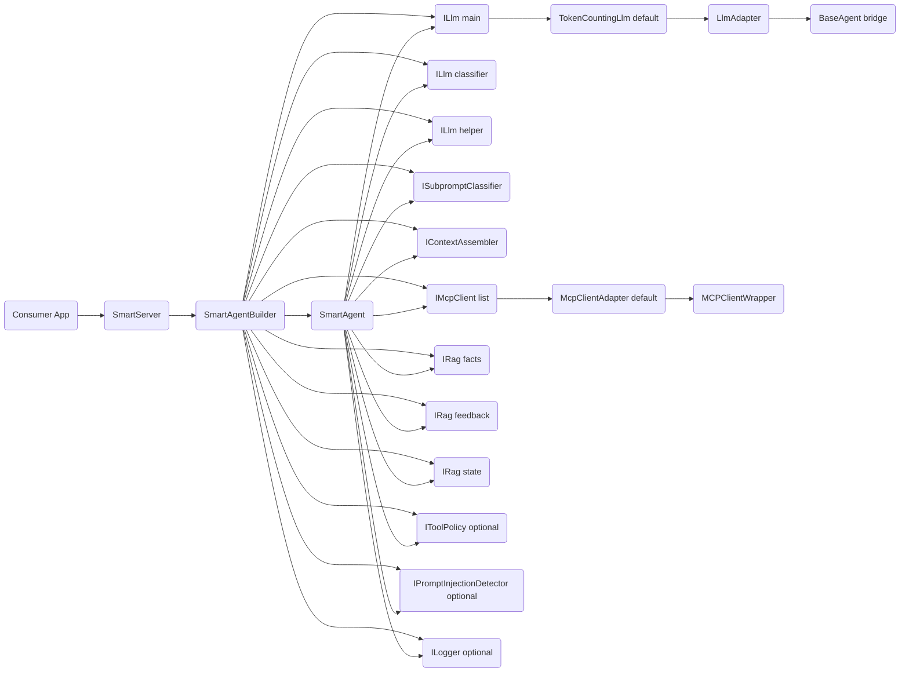

# Architecture

## Scope

`@mcp-abap-adt/llm-agent` currently contains two layers:

1. **Legacy core (`src/agents`, `src/llm-providers`, `src/mcp`)**
- Provider-specific agent implementations and direct MCP integration.
- Kept for backward compatibility and adapter reuse.

2. **Smart Agent stack (`src/smart-agent`)**
- Orchestrated pipeline with classification, RAG retrieval, policy checks, MCP execution loop, and OpenAI-compatible HTTP serving.
- This is the primary runtime architecture for new work.

## Runtime Topology (Smart Stack)

```text
Client (OpenAI-compatible)
  -> SmartServer (HTTP/SSE)
     -> SmartAgentBuilder (wiring + defaults/overrides)
        -> SmartAgent (orchestration loop)
           -> ILlm (main/helper/classifier via adapters)
           -> IRag stores (facts/feedback/state)
           -> IMcpClient[] (one or many MCP endpoints)
           -> Policy guards (tool policy + injection detector)
```

### Dependency Graph (Detailed)



## Embeddable Component Contract (No YAML)

For library embedding, YAML is not required. YAML is only a CLI/runtime convenience for `llm-agent`.

Primary embeddable surfaces:
- package export `@mcp-abap-adt/llm-agent/smart-server` -> `SmartServer`
- package export `@mcp-abap-adt/llm-agent/testing` -> deterministic test doubles for consumer integration tests

Minimal programmatic integration:

```ts
import { SmartServer } from '@mcp-abap-adt/llm-agent/smart-server';

const server = new SmartServer({
  llm: {
    apiKey: process.env.DEEPSEEK_API_KEY!,
    model: 'deepseek-chat',
  },
  mode: 'smart',
});

const handle = await server.start();
// handle.port, handle.getUsage(), handle.close()
```

`SmartServer` public contract:
- input: `SmartServerConfig`
- output: `Promise<SmartServerHandle>`
- lifecycle: `start()` -> `{ port, getUsage, close }`
- protocol: OpenAI-compatible `/v1/chat/completions` (JSON + SSE)

## Request Lifecycle

### 1. Server Boundary

Entry points:
- `src/smart-agent/smart-server.ts` (`SmartServer`)
- `src/smart-agent/server.ts` (`SmartAgentServer`, lightweight/legacy test server)

`SmartServer` responsibilities:
- Parse/validate OpenAI-compatible requests (`/v1/chat/completions`).
- Normalize message content blocks into text.
- Normalize external tool definitions with `normalizeExternalTools()`.
- Emit SSE chunks in OpenAI-compatible sequence.
- Build and hold `SmartAgent` via `SmartAgentBuilder`.

### 2. Orchestration Core

Main implementation:
- `src/smart-agent/agent.ts` (`SmartAgent`)

Pipeline stages:
1. Pre-flight and timeout/abort merging.
2. Subprompt classification (`ISubpromptClassifier`).
3. Optional history summarization (helper LLM).
4. RAG retrieval for action subprompts (`facts/feedback/state`).
5. MCP tool catalog retrieval and tool selection.
6. Context assembly (`IContextAssembler`).
7. Streaming tool loop:
- stream model output,
- accumulate tool-call deltas,
- execute internal MCP tools,
- return external tool calls to caller,
- enforce loop/tool limits.

### 3. LLM Integration

Abstractions:
- `src/smart-agent/interfaces/llm.ts`
- `src/smart-agent/adapters/llm-adapter.ts`

`LlmAdapter` bridges legacy `BaseAgent` implementations to smart-agent `ILlm`.
Providers can be configured through pipeline config (`deepseek`, `openai`, `anthropic`) in:
- `src/smart-agent/pipeline.ts`

### 4. RAG Layer

Core contracts and implementations:
- `src/smart-agent/interfaces/rag.ts`
- `src/smart-agent/rag/vector-rag.ts`
- `src/smart-agent/rag/in-memory-rag.ts`
- `src/smart-agent/rag/ollama-rag.ts`
- `src/smart-agent/rag/openai-embedder.ts`

Stores are split by intent:
- `facts` (domain/tool knowledge)
- `feedback` (user guidance)
- `state` (session memory)

### 5. MCP Layer

- Smart stack uses `IMcpClient` abstraction.
- Default adapter wraps `MCPClientWrapper` from `src/mcp/client.ts`.
- Supports multiple MCP servers simultaneously via builder/pipeline config.

## Internal Interfaces and Default Implementations

| Interface | Role | Default implementation |
|---|---|---|
| `ILlm` | Chat/stream model abstraction used by `SmartAgent` | `TokenCountingLlm(LlmAdapter(BaseAgent))` via `SmartAgentBuilder` |
| `ISubpromptClassifier` | Intent/subprompt decomposition | `LlmClassifier` |
| `IContextAssembler` | Builds final model context window | `ContextAssembler` |
| `IRag` (`facts/feedback/state`) | Retrieval and memory stores | `VectorRag` (Ollama/OpenAI embedders) or `InMemoryRag` |
| `IMcpClient` | Tool catalog and tool execution | `McpClientAdapter(MCPClientWrapper)` |
| `IToolPolicy` | Allow/deny policy checks | `ToolPolicyGuard` (optional) |
| `IPromptInjectionDetector` | Injection heuristics | `HeuristicInjectionDetector` (optional) |
| `ILogger` | Structured logging sink | `ConsoleLogger` / `SessionLogger` / injected custom logger |

Builder wiring entrypoint:
- `src/smart-agent/builder.ts` (`SmartAgentBuilder`)
- supports default wiring plus per-component overrides through `.with*()` methods

## Execution Modes

Configured via `SmartAgentConfig.mode` and `SmartServerMode`:

- `smart`:
- Full orchestration (classification + RAG + MCP selection + tool loop).
- Uses external tools when SAP context is not required.

- `hard`:
- SAP/MCP-focused behavior with strict internal tool context.
- External tools are not active in MCP execution loop.

- `pass`:
- Pure passthrough to main LLM stream over provided history/tools.
- Skips orchestration stages.

## Protocol Contracts

### Streaming Tool Calls

`LlmStreamChunk.toolCalls` supports both finalized calls and deltas:
- `LlmToolCall`
- `LlmToolCallDelta`

Defined in:
- `src/smart-agent/interfaces/types.ts`

Normalization helpers:
- `src/smart-agent/utils/tool-call-deltas.ts`

This removes unsafe cast chains in critical stream paths and keeps delta assembly explicit.

### External Tool Input Contract

Incoming tool payloads are normalized at boundary:
- `src/smart-agent/utils/external-tools-normalizer.ts`

Accepted shapes:
- internal `LlmTool`
- OpenAI-compatible `{ type: 'function', function: { name, description, parameters } }`-like shape (name/function-derived)

Invalid tool shapes are dropped during normalization instead of flowing into runtime logic as opaque objects.
Validation mode is configurable at request boundary:
- `permissive` (default): invalid client tools are dropped and logged.
- `strict`: request is rejected with `400 invalid_request_error` and a validation code.

### Session Tool Availability Contract

Tools can be protocol-valid but temporarily unavailable in the current environment/session.

- Runtime-unavailable tools are temporarily blocked with TTL in a session-scoped registry.
- Blocked tools are excluded from subsequent LLM tool contexts within the session window.
- The agent emits diagnostics for both block events and blocked-tool interceptions.

## Legitimate vs Suspicious Edge Cases

Decision rule:
- **Legitimate**: allowed by upstream protocol/model behavior, must be handled for compatibility.
- **Suspicious**: produced by local contract gaps, cast-driven parsing, or unclear ownership.

### Legitimate (document + test)

- Fragmented SSE tool arguments across chunks.
- Separate usage tail chunk in SSE.
- Unknown/hallucinated tool names from the model.
- Transport-level MCP failures requiring reconnect/retry/fallback.
- Abort, max-iteration, and max-tool-call safety termination.

### Suspicious (refactor/tighten)

- Runtime dependence on `as unknown as ...` in protocol paths.
- Silent parse degradation without diagnostics.
- Heuristic acceptance of malformed boundary payloads.

Action policy:
- Legitimate -> keep behavior, encode as invariant, test it.
- Suspicious -> tighten contracts/DTOs/validators, add diagnostics, and simplify control flow.

## Key Modules

- `src/smart-agent/agent.ts`: orchestration loop and tool execution control.
- `src/smart-agent/smart-server.ts`: production OpenAI-compatible server.
- `src/smart-agent/builder.ts`: dependency wiring and defaults.
- `src/smart-agent/pipeline.ts`: provider/rag factory helpers.
- `src/smart-agent/context/context-assembler.ts`: final context construction.
- `src/smart-agent/classifier/llm-classifier.ts`: subprompt decomposition.
- `src/smart-agent/policy/*`: policy guard + injection detector.
- `src/mcp/client.ts`: transport implementation and resilience behavior.

## Repository Structure (High Level)

```text
src/
  agents/                  # legacy/provider-specific agent implementations
  llm-providers/           # provider clients (OpenAI/Anthropic/DeepSeek/SAP Core)
  mcp/                     # MCP transport client wrapper
  smart-agent/             # primary orchestrated architecture
    adapters/
    classifier/
    context/
    interfaces/
    llm/
    policy/
    rag/
    utils/
    smart-server.ts
    agent.ts
```

## Current Technical Debt (Explicit)

- Legacy provider agents (`src/agents/*`) still rely on permissive provider-payload casts that should be narrowed with stricter DTOs.
- Deprecated test suite `src/smart-agent/__tests__/agent-phase9.test.ts` is intentionally skipped and should be replaced by modern contract-level coverage.
- Runtime diagnostics are session-log-oriented; we still need first-class aggregate metrics/export (counters for parse/validation degradation) for long-running operations.
