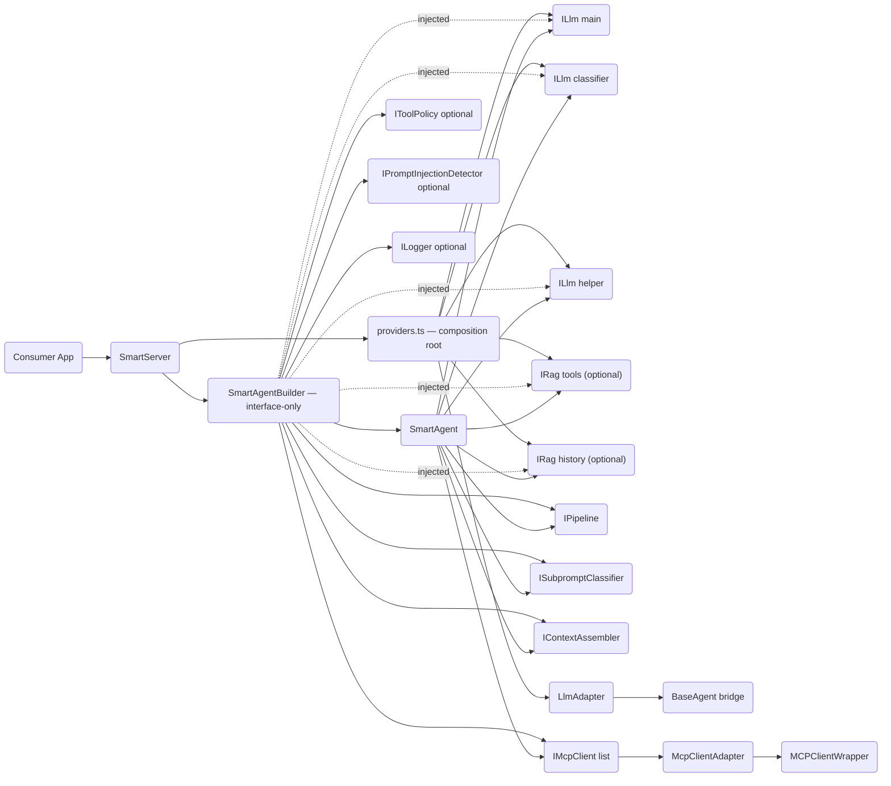
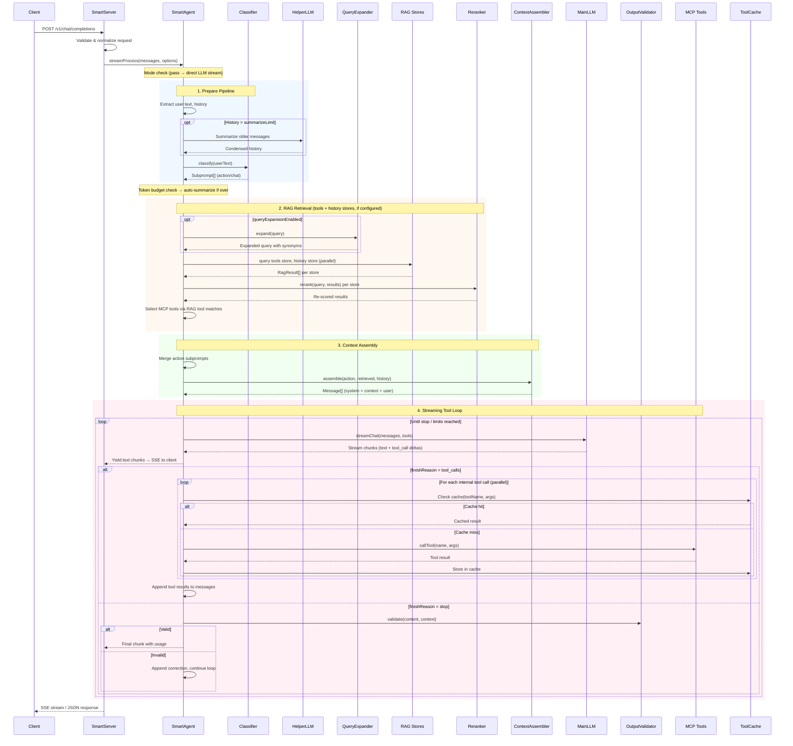

# Architecture

## Architecture Principles

These principles are **binding** for every change in this monorepo. Contributors and
reviewers MUST check a design against each one at brainstorm time (before finalizing)
and at review time (before approving); a violation is a blocking issue, not a nit.

1. **Build ON existing components — never bespoke glue in the app.** Find the component
   that already does the job; if it falls short, **rework/extend that component** so the
   capability lands in the reusable library, not in app-local code.
2. **The app IS the example.** `@mcp-abap-adt/llm-agent-server` / `SmartServer` is a
   working demonstration of *consuming* the libraries. If the app accretes bespoke
   logic, it proves we don't use our own components — so nobody else will. *Corollary:*
   the fix for an over-grown file is NOT to carve it into ad-hoc fragments — it is to
   **reimplement on the components**.
3. **Everything is built around interfaces.** Consumers depend on interfaces, never on
   concrete classes.
4. **Many small interfaces, not one big one (Interface Segregation).** ADD a new focused
   interface; do NOT grow an existing one. *Example:* readiness is a separate
   `IReadinessReporter { isReady() }` (detected via `isReadinessReporter`), not an
   `isReady?()` bolted onto `IMcpConnectionStrategy`.
5. **Variation points the consumer should own are expressed as STRATEGIES.** Anything we
   want to leave to the consumer's choice is a strategy they can swap or implement (e.g.
   `IMcpConnectionStrategy` — `Lazy`/`Periodic`/`Noop`, or a custom one).
6. **Control file size — no multi-thousand-line files.** A giant file is itself a smell;
   put new logic in a small focused module and consume it, rather than appending to a
   god-object.
7. **Don't break components.** Extend additively and backward-compatibly.

> See also **Current Technical Debt** at the end of this document for known violations
> (e.g. an over-grown `smart-server.ts`) being worked down toward these principles.

## Scope

The codebase is split across **six npm packages**:

```
@mcp-abap-adt/llm-agent          contracts: interfaces, public types, lightweight helpers
@mcp-abap-adt/llm-agent-mcp      MCP client wrapper + adapter + connection strategies
@mcp-abap-adt/llm-agent-rag      RAG/embedder composition (makeRag, resolveEmbedder, factories)
@mcp-abap-adt/llm-agent-libs     core composition: builder, agent, pipeline, sessions, ...
@mcp-abap-adt/llm-agent-server-libs SmartServer composition library + pipeline builder-factories
@mcp-abap-adt/llm-agent-server   binary only (CLI + HTTP server, no library exports)
```

### Package responsibilities

- **`@mcp-abap-adt/llm-agent`** — contracts: all `I*` interfaces, shared types/DTOs, and lightweight helpers usable when embedding SmartAgent in your own server. Includes `CircuitBreaker` family, the embedder resilience decorators (`BatchChunkingEmbedder`, `RetryEmbedder`, `composeResilientEmbedder`), `FallbackRag`, LLM call strategies, `ToolCache`/`NoopToolCache`, `ClineClientAdapter`, `AnthropicApiAdapter`/`OpenAiApiAdapter`, external-tools normalization, tool-call-delta utilities, `ILogger`, and RAG implementations (`InMemoryRag`, `VectorRag`, `QdrantRag`, etc.).

- **`@mcp-abap-adt/llm-agent-mcp`** — `MCPClientWrapper`, `McpClientAdapter`, factory (`createDefaultMcpClient`), and connection strategies (`LazyConnectionStrategy`, `PeriodicConnectionStrategy`, `NoopConnectionStrategy`). Depends on `llm-agent`.

- **`@mcp-abap-adt/llm-agent-rag`** — RAG and embedder composition. `makeRag` is **async** (`Promise<IRag>`); it auto-prefetches backends so no manual warm-up is needed for one-shot use. `resolveEmbedder` stays **synchronous** (call `prefetchEmbedderFactories([...])` once at startup for hot-path sync resolves). Embedder/RAG backend packages are optional peers of this package — library-mode consumers install only what they use. (At the binary level, `@mcp-abap-adt/llm-agent-server` ≥ 13.1.0 bundles all backends as regular deps; config selects which to activate.) Depends on `llm-agent`.

- **`@mcp-abap-adt/llm-agent-libs`** — core composition runtime: `SmartAgentBuilder`, agent, pipeline, sessions, history, resilience, observability, plugins, skills, plus LLM factories (`makeLlm`, `makeDefaultLlm` — both **async**). LLM provider packages are optional peers of this package — library-mode consumers install only what they use. (At the binary level, `@mcp-abap-adt/llm-agent-server` ≥ 13.1.0 bundles all providers as regular deps.) `SmartAgentBuilder.build()` is async (unchanged externally). Depends on `llm-agent`, `llm-agent-mcp`, `llm-agent-rag`.

- **`@mcp-abap-adt/llm-agent-server-libs`** — the SmartServer composition runtime as an importable library: `SmartServer`, `buildFromComposition`/`buildStepperRoot`, `StepperCoordinatorHandler`, coordinator config parsing, session stores, and the **pipeline builder-factories** (`LinearFactory`, `DagFactory`, `CyclicFactory`, `PlannedFactory`, `DeepStepperFactory`, `ControllerFactory` — each builds one pipeline's `coordinator` stage handler from a typed config + role-resolving deps). Depends on `llm-agent`, `llm-agent-libs`, `llm-agent-mcp`, `llm-agent-rag`.

- **`@mcp-abap-adt/llm-agent-server`** — binary only: CLI (`llm-agent`, `llm-agent-check`, `claude-via-agent`) and HTTP server. **Not a library** — importing from this package as a library is not supported as of 12.0.1. A thin wrapper over `llm-agent-server-libs`. Depends on `llm-agent-server-libs`.

### Package dependency graph

```
llm-agent-server
  └── llm-agent-server-libs
        └── llm-agent-libs
              ├── llm-agent-mcp
              │     └── llm-agent
              ├── llm-agent-rag
              │     └── llm-agent
              └── llm-agent
```

Optional peer dependencies (not in the graph above):
- `llm-agent-libs` → `@mcp-abap-adt/openai-llm`, `@mcp-abap-adt/anthropic-llm`, `@mcp-abap-adt/deepseek-llm`, `@mcp-abap-adt/sap-aicore-llm`, `@mcp-abap-adt/ollama-llm`
- `llm-agent-rag` → `@mcp-abap-adt/openai-embedder`, `@mcp-abap-adt/ollama-embedder`, `@mcp-abap-adt/sap-aicore-embedder`, `@mcp-abap-adt/qdrant-rag`, `@mcp-abap-adt/hana-vector-rag`, `@mcp-abap-adt/pg-vector-rag`

### Key API notes (since 12.0.1)

- `makeLlm(cfg, temperature)` → `Promise<ILlm>` (async)
- `makeDefaultLlm(cfg)` → `Promise<ILlm>` (async)
- `makeRag(cfg, options)` → `Promise<IRag>` (async)
- `resolveEmbedder(cfg, options)` → `IEmbedder` (sync — call `prefetchEmbedderFactories([...])` once at startup before using this hot-path resolver; NOT required before `makeRag`)
- `SmartAgentBuilder.build()` → `Promise<SmartAgentHandle>` (async, unchanged externally)

Missing optional providers throw `MissingProviderError` at first use.

### Legacy internal source structure

`llm-agent-server` previously housed all SmartAgent code under `src/smart-agent/`. That code now lives in the library packages above. The legacy paths below are preserved for reference but no longer reflect the active source layout:

- **Legacy core** (`src/agents`, `src/llm-providers`, `src/mcp`) — provider-specific agent implementations and direct MCP integration. Kept for backward compatibility.
- **Smart Agent stack** (`src/smart-agent`) — orchestrated pipeline; now distributed across `llm-agent-libs`, `llm-agent-mcp`, and `llm-agent-rag`.

## Runtime Topology (Smart Stack)

```text
Client (OpenAI-compatible)
  -> SmartServer (HTTP/SSE) — composition root
     -> providers.ts (resolves config → concrete ILlm, IRag, IEmbedder)
     -> SmartAgentBuilder (interface-only wiring, no provider knowledge)
        -> SmartAgent (orchestration loop)
           -> ILlm (main/helper/classifier via adapters)
           -> IPipeline (request orchestration — DefaultPipeline or consumer-defined)
                -> coordinator stage (optional) -> SubAgentRegistry
                                                   └── nested SmartAgent (per subagent)
                                                         └── ILlm, IPipeline (DefaultPipeline)
                                                         └── IMcpClient, IRag (per-subagent)
           -> IRag stores (tools / history — consumer-defined)
           -> IMcpClient[] (one or many MCP endpoints)
           -> Policy guards (tool policy + injection detector)
```

### Dependency Graph (Detailed)



### Multi-agent orchestration (overview)

`DefaultPipeline` can operate in two modes depending on configuration. In the default mode, a single `tool-loop` stage handles all LLM interaction and MCP tool execution for a request. When `withCoordinator(...)` is called on the builder and the activation strategy fires, the `tool-loop` stage is replaced by a `coordinator` stage that autonomously drives N subagents through a planner LLM. Each subagent is a full `SmartAgent` with its own `pipeline.llm`, MCP clients, and RAG stores, independent of the parent agent. The coordinator decomposes the incoming request into a multi-step plan, dispatches each step to the appropriate subagent (or back to itself), and aggregates results. All earlier pipeline stages — classify, RAG retrieval, tool-select, assemble — still run and feed context into the coordinator's planner. See [Subagent orchestration](#subagent-orchestration) for the subagent infrastructure and [Coordinator orchestration](#coordinator-orchestration) for the autonomous planning driver.

## Inbound API Adapter Layer

SmartServer supports multiple inbound API protocols via `ILlmApiAdapter`. Each adapter is a stateless singleton registered by name; the server selects the adapter based on the HTTP route.

```text
[Client]
  → POST /v1/chat/completions   → OpenAiApiAdapter   ──┐
  → POST /v1/messages           → AnthropicApiAdapter ──┤
                                                         ▼
                                                    SmartAgent
                                                         │
                                                         ▼
                                                       ILlm  → Provider
```

Adapter responsibilities:
- `normalizeRequest()` — parse the protocol-specific body into internal `NormalizedRequest` (messages + options)
- `transformStream()` — convert the agent's `AsyncIterable<LlmStreamChunk>` into `AsyncIterable<ApiSseEvent>` with protocol-specific SSE event names and data shapes
- `formatResult()` — format a completed response for the wire
- `formatError()` — optional; format errors into the protocol's error envelope

Custom adapters are registered via `builder.withApiAdapter()`, the `apiAdapters` SmartServer config field, or the `apiAdapters` plugin export. Set `disableBuiltInAdapters: true` in SmartServer config to suppress the built-in OpenAI and Anthropic adapters.

Packages:
- `@mcp-abap-adt/llm-agent` — `ILlmApiAdapter`, `ApiRequestContext`, `ApiSseEvent`, `AdapterValidationError`
- `@mcp-abap-adt/llm-agent` — `OpenAiApiAdapter`, `AnthropicApiAdapter`

## Embeddable Component Contract (No YAML)

For library embedding, YAML is not required. YAML is only a CLI/runtime convenience for `llm-agent`.

Primary embeddable surfaces:
- `@mcp-abap-adt/llm-agent-libs` -> `SmartAgentBuilder` (programmatic composition)
- `@mcp-abap-adt/llm-agent-libs/testing` -> deterministic test doubles for consumer integration tests
- `@mcp-abap-adt/llm-agent-libs/otel` -> OpenTelemetry tracer adapter
- `@mcp-abap-adt/llm-agent-server` -> binary CLI (`llm-agent`, `llm-agent-check`, `claude-via-agent`) + HTTP server (not a library)

Minimal programmatic integration:

```ts
import { SmartAgentBuilder } from '@mcp-abap-adt/llm-agent-libs';

const handle = await new SmartAgentBuilder()
  .withMainLlm({
    provider: 'deepseek',
    apiKey: process.env.DEEPSEEK_API_KEY!,
    model: 'deepseek-chat',
  })
  .build();

// handle.agent.process(messages, options)
// handle.close()
```

`SmartAgentBuilder` public contract:
- input: fluent builder methods (`.withMainLlm()`, `.withRag()`, `.withMcp()`, `.withClassifier()`, etc.)
- output: `Promise<SmartAgentHandle>` via `.build()`
- lifecycle: `handle.agent.process(...)` -> `SmartAgentResponse`; `handle.close()` releases resources

To run the HTTP server (OpenAI-compatible `/v1/chat/completions`), use the CLI binary instead:

```bash
npx llm-agent --config smart-server.yaml
# or
npm run dev
```

## Request Processing Flow



### Key decision points

1. **Mode selection** — `pass` skips the entire pipeline and streams directly from LLM. `smart` runs full orchestration. `hard` forces the worker to execute only internal MCP tools; client/external tools are still offered and their calls surfaced to the consumer.
2. **RAG retrieval** — When RAG stores are configured, they are queried in parallel. Each store can have its own search strategy (`ISearchStrategy`) and query preprocessors (`IQueryPreprocessor`). The preprocessor chain runs before embedding — e.g. `TranslatePreprocessor` translates non-English queries, `ExpandPreprocessor` adds synonyms. The search strategy scores candidates — `RrfStrategy` (Reciprocal Rank Fusion) is recommended for best results. `CompositeStrategy` allows combining multiple strategies with configurable weights.
3. **Tool routing** — Tool calls from LLM are classified as: internal (MCP), external (client-provided), hallucinated (unknown), or blocked (temporarily unavailable). Each category has distinct handling.
4. **Loop termination** — The tool loop exits on: `finishReason: stop`, `maxIterations` reached, `maxToolCalls` exhausted, abort signal, or external tool call delegation.
5. **onBeforeStream hook** — If an `onBeforeStream` hook is configured, the final response content is passed through it before streaming to the caller (e.g., for reformatting or post-processing).

## Request Lifecycle

### 1. Server Boundary

Entry points:
- `SmartServer` — in `@mcp-abap-adt/llm-agent-server-libs`
- `SmartAgentServer` — lightweight/legacy test server, in `@mcp-abap-adt/llm-agent-server`

`SmartServer` responsibilities:
- Parse/validate OpenAI-compatible requests (`/v1/chat/completions`).
- Normalize message content blocks into text.
- Normalize external tool definitions with `normalizeExternalTools()`.
- Emit SSE chunks in OpenAI-compatible sequence.
- Build and hold `SmartAgent` via `SmartAgentBuilder`.

### 2. Orchestration Core

Main implementation:
- `SmartAgent` — in `@mcp-abap-adt/llm-agent-libs`

SmartAgent delegates request orchestration to the injected `IPipeline`:

1. Pre-flight and timeout/abort merging.
2. `pipeline.initialize(deps)` is called once at build time.
3. Per request: `pipeline.execute(input, history, options, yieldChunk)`.
4. `DefaultPipeline` (built-in): [classify (off by default)] → summarize → RAG query (tools + history) → rerank → skill-select → tool-select → assemble → tool-loop → history-upsert. Classification is disabled by default — all input is treated as a single action. Enable via `classificationEnabled: true` for custom pipelines with multi-store routing.
5. Consumer pipelines can replace any or all stages.

See [Pipeline Architecture](#pipeline-architecture) for details.

### 3. LLM Integration

Abstractions:
- `ILlm` interface — in `@mcp-abap-adt/llm-agent`
- `LlmAdapter` — in `@mcp-abap-adt/llm-agent-libs`; bridges legacy `BaseAgent` implementations to `ILlm`

Concrete provider resolution is centralized in `makeLlm`/`makeDefaultLlm` (in `@mcp-abap-adt/llm-agent-libs`). LLM provider packages are optional peers of `llm-agent-libs` (library mode):
- `@mcp-abap-adt/openai-llm`, `@mcp-abap-adt/anthropic-llm`, `@mcp-abap-adt/deepseek-llm`, `@mcp-abap-adt/sap-aicore-llm`, `@mcp-abap-adt/ollama-llm`

At the binary level, `@mcp-abap-adt/llm-agent-server` ≥ 13.1.0 bundles all five as regular deps so `npm install -g @mcp-abap-adt/llm-agent-server` works without further peer install. Configuration (YAML/CLI) chooses which one to activate per request.

Pipeline config types (`deepseek`, `openai`, `anthropic`, `sap-ai-sdk`, `ollama`) are defined in:
- `@mcp-abap-adt/llm-agent` (types only, no provider logic)

### 4. RAG Layer

Core contracts (in `@mcp-abap-adt/llm-agent`):
- `IEmbedder`, `IRag`, `EmbedderFactory` — core RAG interfaces
- `ISearchStrategy` — pluggable scoring algorithms
- `IQueryPreprocessor`, `IDocumentEnricher` — query/document transformation
- `IToolIndexingStrategy` — tool description variants for indexing

RAG store implementations (in `@mcp-abap-adt/llm-agent`):
- `VectorRag` — hybrid search (vector + BM25), accepts strategy/preprocessors
- `InMemoryRag` — text-only (token frequency), accepts preprocessors

RAG/embedder backends (optional peers of `@mcp-abap-adt/llm-agent-rag` for library mode; bundled as regular deps of `@mcp-abap-adt/llm-agent-server` ≥ 13.1.0):
- `@mcp-abap-adt/qdrant-rag` — external Qdrant vector database
- `@mcp-abap-adt/hana-vector-rag` — SAP HANA vector store
- `@mcp-abap-adt/pg-vector-rag` — Postgres + pgvector
- `@mcp-abap-adt/openai-embedder`, `@mcp-abap-adt/ollama-embedder`, `@mcp-abap-adt/sap-aicore-embedder`

Search strategies (`ISearchStrategy`):
- `WeightedFusionStrategy` — weighted sum of vector + BM25 scores (default)
- `RrfStrategy` — Reciprocal Rank Fusion (rank-based, score-magnitude-independent)
- `VectorOnlyStrategy`, `Bm25OnlyStrategy` — single-method baselines
- `CompositeStrategy` — combines multiple child strategies via weighted RRF

Query preprocessors (`IQueryPreprocessor`):
- `TranslatePreprocessor` — LLM-based query translation to English
- `ExpandPreprocessor` — LLM-based synonym expansion
- `PreprocessorChain` — sequential composition

Tool indexing strategies (`IToolIndexingStrategy`):
- `OriginalToolIndexing` — raw description (default)
- `IntentToolIndexing` — LLM-generated intent keywords
- `SynonymToolIndexing` — deterministic action verb synonyms

Embedders are injectable via DI:
- Programmatic: `SmartServer({ embedder: myEmbedder })`
- YAML-driven: register custom factory via `SmartServer({ embedderFactories: { 'my-embedder': fn } })`, then reference in YAML as `embedder: my-embedder`

Stores are consumer-defined. The built-in DefaultPipeline recognizes two store keys:
- `tools` (tool/skill schemas for RAG-based tool selection)
- `history` (semantic conversation history / long-term memory)

Both are optional. Consumer pipelines may define additional stores with arbitrary keys — the
DefaultPipeline simply queries the stores it receives; it does not hard-code any store names.

The builder selects the `tools` store by key for tool/skill vectorization at startup. If no `tools` store is provided, tool vectorization is skipped and all MCP tools are included in every request context.

Each tool's RAG record id comes from an `IToolRecordKey` strategy. The default keeps `tool:${name}` for a single MCP server and disambiguates by client index once several are connected (the `mcp:` config accepts an array), so identically named tools from different servers no longer overwrite each other. A consumer that knows its servers injects its own via `SmartAgentBuilder.withToolRecordKey` — keying by real server name, a per-server collection, or any scheme whose id keeps the `tool:` prefix (retrieval uses it to separate tools from skills; a key that drops it fails the boot). Server↔client is 1:1, so the client index identifies the server for the default.

**Idempotent upsert contract:** when `metadata.id` is provided, implementations MUST treat it as an idempotent key — repeated upserts with the same id replace the previous record instead of creating duplicates. All built-in implementations (`QdrantRag`, `InMemoryRag`, `VectorRag`) enforce this.

**v9.1 additions:** `IRagProviderRegistry` manages named `IRagProvider` instances that the LLM can use (via MCP tools) to create collections at runtime. `IRagRegistry` is extended with `createCollection` / `deleteCollection` / `closeSession` to support this lifecycle. The existing `ragStores` map remains as a backwards-compatible live projection of all currently active collections. See [docs/INTEGRATION.md#iragprovider](INTEGRATION.md#iragprovider) for full details.

### 5. MCP Layer

> **Design invariant — the runtime is absolutely MCP-agnostic.** `llm-agent`
> makes **no** assumptions about which MCP server it talks to or which tools
> exist. Tools are discovered via `tools/list` and selected by their
> descriptions (semantic ranking through the tools-RAG); **no tool name,
> behaviour, or server quirk is hardcoded in the agent.** Consequence: when a
> model misuses a tool (e.g. picks `GetProgram` instead of `GetInclude` for an
> include), the fix belongs on the **MCP server side** — sharpen the tool
> descriptions so selection routes correctly — or in seeded RAG guidance
> (data), **never** in an agent code branch keyed on a specific tool name. Keep
> domain/tool knowledge out of the agent; push it into tool descriptions (which
> arrive via `tools/list`) or configurable RAG content.

- Smart stack uses `IMcpClient` abstraction (interface in `@mcp-abap-adt/llm-agent`).
- Default adapter wraps `MCPClientWrapper` from `@mcp-abap-adt/llm-agent-mcp`.
- Supports multiple MCP servers simultaneously via builder/pipeline config.
- Health checks use lightweight MCP ping (`MCPClientWrapper.ping()`) instead of `listTools()`, avoiding unnecessary tool catalog requests when health is polled frequently.
- **Reconnection** — `IMcpConnectionStrategy` is an optional dependency injected via `builder.withMcpConnectionStrategy()`. It is called at the start of each request to resolve the current set of live MCP clients. Built-in strategies: `NoopConnectionStrategy` (pass-through, default behaviour), `LazyConnectionStrategy` (reconnects on demand with cooldown), `PeriodicConnectionStrategy` (reconnects on a background timer).

### 6. Skills Layer

Skills are reusable instruction packages (SKILL.md files) that inject context into the LLM system prompt. Unlike MCP tools (which provide actions), skills provide guidelines, domain knowledge, and behavioral instructions.

**Startup flow:**
- `SmartAgentBuilder.build()` calls `skillManager.listSkills()`
- Each skill is vectorized into facts RAG: `"Skill: <name>\n<description>"` with metadata `{ id: "skill:<name>" }`
- Skills coexist with tools in the same facts store

**Per-request flow:**
- `skill-select` handler extracts `skill:*` IDs from RAG results
- If none found (skills drowned out by tools), does a dedicated fallback RAG query
- Loads content via `ISkill.getContent()` with `$ARGUMENTS` / `$CLAUDE_SKILL_DIR` substitution
- `assemble` handler appends skill content as `## Active Skills` section in system message

**Three built-in managers:**

| Manager | Discovery paths | Vendor logic |
|---------|----------------|--------------|
| `ClaudeSkillManager` | `~/.claude/skills/` + `<project>/.claude/skills/` | Maps kebab-case frontmatter (`disable-model-invocation` → `disableModelInvocation`) |
| `CodexSkillManager` | `~/.agents/skills/` + `<project>/.agents/skills/` | Parses optional `agents/openai.yaml` into meta extensions |
| `FileSystemSkillManager` | Configurable `dirs[]` | None — simplest variant |

**SKILL.md format:**
```markdown
---
name: skill-name
description: One-line description (used for RAG matching)
user-invocable: true
argument-hint: "<argument description>"
---

Skill instructions here. Use $ARGUMENTS for invocation args
and $CLAUDE_SKILL_DIR for the skill directory path.
```

**Configuration (YAML):**
```yaml
skills:
  type: claude          # claude | codex | filesystem
  dirs:                 # filesystem type only
    - ./my-skills
  projectRoot: .        # claude/codex type, defaults to cwd
```

**Configuration (programmatic):**
```ts
builder.withSkillManager(new ClaudeSkillManager(process.cwd()));
```

#### Skill plugin-host (runtime gnostification — `skillPlugins:`)

A **second, distinct** skills channel, separate from the SKILL.md skill-manager
above. The skill plugin-host (`@mcp-abap-adt/llm-agent-libs/skills/plugin-host`,
`ISkillPluginHost`) is a **domain-agnostic** host that materializes
**consumer-supplied** skills into a grouped, durable **skills-RAG** and serves
recall — so the engine (MIT) bundles no domain knowledge, yet any model is
gnosticized at runtime.

- **Composition.** An injected acquisition+materialization **strategy** (owns
  collection placement — the host imposes no grouping rule) over a **store
  provider**. A single fenced **catalog commit** is the only activation:
  generations build inactive, multi-source results merge (union + ownership;
  conflicting descriptions error), a failed source carries forward, and orphaned
  generations are reclaimed by an age-protected, crash-resumable sweeper.
- **Stores.** `in-memory` (refcount-lease retention) or `qdrant` vectors with a
  durable **Postgres catalog** (conditional-UPDATE CAS), deterministic UUIDv5
  point ids, and read-only reader interfaces for least-privilege recall-only
  serving. The activation ingest waits for point visibility (`wait=true`) before
  the catalog is published, so recall never sees a half-built active generation.
- **Consumption.** Implicit for the assembler pipelines (`flat`/default,
  `linear`, `dag`) via an `IRag` source rendered under a "Relevant Skills" block. For the
  `controller` pipeline, the planner recalls the configured `controllerSkillGroup` and the
  finalizer honors any output/delivery/formatting directives the skills specify. Wired from
  the `skillPlugins:` server config (see EXAMPLES.md). `mode: explicit` and stepper
  implicit wiring are follow-on.

## Internal Interfaces and Default Implementations

| Interface | Role | Default implementation |
|---|---|---|
| `ILlm` | Chat/stream model abstraction used by `SmartAgent`; optional `getModels()` for model discovery | `RetryLlm(CircuitBreakerLlm(LlmAdapter(BaseAgent)))` via `providers.ts` + `builder.ts`; `NonStreamingLlm` decorator proxies `getModels()` and `healthCheck()` |
| `IRequestLogger` | Per-model, per-component usage tracking | `DefaultRequestLogger` (auto-created by builder) |
| `IModelProvider` | Model discovery and per-request model selection; exposes `getEmbeddingModels()` served via `GET /v1/embedding-models` | `LlmAdapter` (auto-detected from `mainLlm`) |
| `IEmbedder` | Text → vector embedding; `embed()` returns `IEmbedResult { vector: number[]; usage?: { promptTokens: number; totalTokens: number } }` | `OllamaEmbedder`, `OpenAiEmbedder`, or custom via DI |
| `ISubpromptClassifier` | Intent/subprompt decomposition | `LlmClassifier` |
| `IContextAssembler` | Builds final model context window | `ContextAssembler` |
| `IRag` (`tools`/`history` + consumer-defined) | Retrieval and memory stores | `InMemoryRag` (BM25), `VectorRag` (in-memory + embedder), `QdrantRag`, `HanaVectorRag`, or `PgVectorRag` |
| `IMcpClient` | Tool catalog and tool execution | `McpClientAdapter(MCPClientWrapper)` |
| `IMcpConnectionStrategy` | Per-request MCP reconnection / health recovery | `NoopConnectionStrategy` (no-op, default); `LazyConnectionStrategy` / `PeriodicConnectionStrategy` for auto-reconnect |
| `IReadinessReporter` | Whether the server is ready to serve requests (readiness gate) | Connection strategies implement it; detected via `isReadinessReporter(x)` type guard |
| `IMcpFailureClassifier` | Classifies mid-run MCP errors as `'unavailable'` (fail-loud) or `'tool-error'` (transient) | Default: error-based heuristic; inject custom via `BuildAgentDeps.mcpFailureClassifier` |
| `IToolLoopContextStrategy` | Controls how the tool-loop context window grows across iterations (token management) | `RagRecall` (controller), `Window` (server default), `Legacy` (bare agent); injectable via `BuildAgentDeps` |
| `IStepExecutionControl` | Per-step budget gate for the controller (`beginStep` → `IStepBudget` with `signal`, `shouldContinueRound`, `canExecuteTool`) | Default implementation driven by `budgets.perStepTimeoutMs` and `budgets.maxToolCalls` |
| `IRunExecutionControl` | Run-level budget gate (rewinds, resumptions, retries) | Default driven by controller `budgets` fields |
| `IAuxiliaryMcpTools` | In-process auxiliary tools offered to the executor (e.g. built-in `wait`) | `DefaultAuxiliaryMcpTools`; inject `new DefaultAuxiliaryMcpTools([])` to suppress all auxiliary tools |
| `IToolPolicy` | Allow/deny policy checks | `ToolPolicyGuard` (optional) |
| `IPromptInjectionDetector` | Injection heuristics | `HeuristicInjectionDetector` (optional) |
| `ISkillManager` | Skill discovery and content loading | `ClaudeSkillManager`, `CodexSkillManager`, `FileSystemSkillManager` (optional) |
| `ILogger` | Structured logging sink | `ConsoleLogger` / `SessionLogger` / injected custom logger |

### Separation of concerns

- **`SmartAgentBuilder`** (in `@mcp-abap-adt/llm-agent-libs`) — interface-only factory. Accepts `ILlm`, `IRag`, `IMcpClient`, `IPipeline`, etc. Has no knowledge of concrete providers. RAG stores are injected via `.setToolsRag(rag)` and `.setHistoryRag(rag)`; a custom pipeline is injected via `.setPipeline(pipeline)`. Supports an optional `onBeforeStream` hook (set via `.withOnBeforeStream(hook)`) for post-processing the final response before it is streamed to the caller.
- **`makeLlm`/`makeDefaultLlm`** (in `@mcp-abap-adt/llm-agent-libs`) — composition root for LLMs. The only place that imports concrete LLM provider packages. Resolves config → `ILlm` instance. **Async** since 12.0.1.
- **`makeRag`/`resolveEmbedder`** (in `@mcp-abap-adt/llm-agent-rag`) — composition root for RAG/embedders. Resolves config → `IRag`/`IEmbedder`. `makeRag` is **async** and auto-prefetches — no warm-up needed for one-shot use. `resolveEmbedder` is **sync** — call `prefetchEmbedderFactories([...])` once at startup before using this hot-path resolver.
- **`SmartServer`** (in `@mcp-abap-adt/llm-agent-server-libs`) — uses `makeLlm`/`makeRag` to resolve config, then injects interfaces into `SmartAgentBuilder`.

## Execution Modes

Configured via `SmartAgentConfig.mode` and `SmartServerMode`:

- `smart`:
- Full orchestration (classification + RAG + MCP selection + tool loop).
- Uses external tools when SAP context is not required.

- `hard`:
- SAP/MCP-focused behavior with strict internal tool context.
- The worker executes only internal MCP tools; client/external tools remain
  offered and their calls are surfaced to the consumer (consumer-executed).

- `pass`:
- Pure passthrough to main LLM stream over provided history/tools.
- Skips orchestration stages.

### Streaming modes

Configured via `SmartAgentConfig.streamMode`:

- `full` (default): all chunks streamed immediately, including intermediate tool loop iterations.
- `final`: intermediate iterations are buffered and discarded; only the final response is streamed. External tool calls and heartbeats are always streamed regardless of mode. Useful for clients (Cline, Goose) that accumulate chunks in their context window.

### Resilience decorators

The `ILlm` chain supports two optional decorators, composed by the builder:

- **`RetryLlm`** — retries transient failures (429, 5xx) with exponential backoff. Configured via `SmartAgentConfig.retry`. For streaming, retries pre-stream failures (zero chunks yielded) on HTTP status codes, and mid-stream failures on configurable error substrings (`retryOnMidStream`). Mid-stream retry replays the entire stream and emits a `reset` chunk so consumers discard accumulated state.
- **`CircuitBreakerLlm`** — fail-fast on sustained failures. Configured via `.withCircuitBreaker()`.

Composition order: `RetryLlm → CircuitBreakerLlm → LlmAdapter`. Retry sits outside the circuit breaker so retry attempts are not counted as separate failures. Token usage is tracked by `IRequestLogger` (injected via builder) rather than a decorator wrapper.

The `IEmbedder` chain has its own pair, composed once by `resolveEmbedder` (`@mcp-abap-adt/llm-agent-rag`) so that **every** `embedBatch` caller inherits them — startup MCP tool vectorization, document ingest, and anything a consumer writes:

- **`BatchChunkingEmbedder`** — splits `embedBatch` input into provider-safe chunks, sequentially (concurrent chunks would reintroduce the rate limiting chunking exists to avoid). The chunk size comes from `rag.maxBatchSize` → the provider's `IBatchSizeLimited.maxBatchSize` → `DEFAULT_MAX_BATCH_SIZE` (100). Validates the cap as a positive safe integer at construction and rejects a chunk that returns the wrong number of embeddings.
- **`RetryEmbedder` / `RetryBatchEmbedder`** — retry with exponential backoff, selected by the `withRetry` factory. Retry classification is shared with `RetryLlm` via `isRetryableStatus` (structured status first, word-boundary message match as a last resort), so the two decorators cannot drift.
- **`CircuitBreakerEmbedder` / `CircuitBreakerEmbedderBase`** — fail-fast on sustained failures, selected by the `withCircuitBreaker` factory. Not part of the default chain; a consumer composes it explicitly.

Composition order: `wrapEmbedder(BatchChunkingEmbedder(RetryBatchEmbedder(provider)))`. Retry sits **inside** chunking so each chunk retries independently — a failure on chunk 20 must not re-issue chunks 1-19.

Two invariants hold across that chain:

- **Batch capability is preserved, never fabricated.** `isBatchEmbedder` only tests for the presence of `embedBatch`, so each layer picks its class by inspecting its inner (the `wrapEmbedder` pattern, shared by `withRetry` and `withCircuitBreaker`). A decorator that exposed `embedBatch` unconditionally would make a non-batch embedder look batch-capable and send callers down the batch path.
- **Composition is idempotent, and its metadata travels.** `composeResilientEmbedder` brands the chain with a symbol-keyed `{ maxBatchSize }`, and `wrapEmbedder` propagates that brand onto its own wrapper — its `inner` is `protected`, so a re-resolution could not otherwise see it and would stack the decorators. The cap is owned by the first composition; a later call carrying a *different explicit* `maxBatchSize` keeps the original and logs one warning.

## Protocol Contracts

### Streaming Tool Calls

`LlmStreamChunk.toolCalls` supports both finalized calls and deltas:
- `LlmToolCall`
- `LlmToolCallDelta`

Defined in:
- `@mcp-abap-adt/llm-agent` — `LlmStreamChunk`, `LlmToolCall`, `LlmToolCallDelta`

Normalization helpers:
- `@mcp-abap-adt/llm-agent` — `getStreamToolCallName`, `toToolCallDelta`

This removes unsafe cast chains in critical stream paths and keeps delta assembly explicit.

### External Tool Input Contract

Incoming tool payloads are normalized at boundary:
- `@mcp-abap-adt/llm-agent` — `normalizeAndValidateExternalTools`, `normalizeExternalTools`

Accepted shapes:
- internal `LlmTool`
- OpenAI-compatible `{ type: 'function', function: { name, description, parameters } }`-like shape (name/function-derived)

Invalid tool shapes are dropped during normalization instead of flowing into runtime logic as opaque objects.
Validation mode is configurable at request boundary:
- `permissive` (default): invalid client tools are dropped and logged.
- `strict`: request is rejected with `400 invalid_request_error` and a validation code.

### Session Tool Availability Contract

Tools can be protocol-valid but temporarily unavailable in the current environment/session.

- Runtime-unavailable tools are temporarily blocked with TTL in a session-scoped registry.
- Blocked tools are excluded from subsequent LLM tool contexts within the session window.
- The agent emits diagnostics for both block events and blocked-tool interceptions.

## Legitimate vs Suspicious Edge Cases

Decision rule:
- **Legitimate**: allowed by upstream protocol/model behavior, must be handled for compatibility.
- **Suspicious**: produced by local contract gaps, cast-driven parsing, or unclear ownership.

### Legitimate (document + test)

- Fragmented SSE tool arguments across chunks.
- Separate usage tail chunk in SSE.
- Unknown/hallucinated tool names from the model.
- Transport-level MCP failures requiring reconnect/retry/fallback.
- Abort, max-iteration, and max-tool-call safety termination.

### Suspicious (refactor/tighten)

- Runtime dependence on `as unknown as ...` in protocol paths.
- Silent parse degradation without diagnostics.
- Heuristic acceptance of malformed boundary payloads.

Action policy:
- Legitimate -> keep behavior, encode as invariant, test it.
- Suspicious -> tighten contracts/DTOs/validators, add diagnostics, and simplify control flow.

## Key Modules

| Module | Package | Role |
|---|---|---|
| `SmartAgent` | `@mcp-abap-adt/llm-agent-libs` | Orchestration loop and tool execution control |
| `SmartServer` | `@mcp-abap-adt/llm-agent-server-libs` | Production OpenAI-compatible HTTP server |
| `SmartAgentBuilder` | `@mcp-abap-adt/llm-agent-libs` | Interface-only dependency wiring (no provider knowledge) |
| `makeLlm` / `makeDefaultLlm` | `@mcp-abap-adt/llm-agent-libs` | Composition root — concrete LLM provider resolution (async) |
| `makeRag` / `resolveEmbedder` | `@mcp-abap-adt/llm-agent-rag` | RAG/embedder resolution |
| `DefaultPipeline` / `PipelineExecutor` | `@mcp-abap-adt/llm-agent-libs` | Built-in `IPipeline` implementation |
| `ContextAssembler` | `@mcp-abap-adt/llm-agent-libs` | Final LLM context construction |
| `LlmClassifier` | `@mcp-abap-adt/llm-agent-libs` | Subprompt decomposition |
| `ToolPolicyGuard` / `HeuristicInjectionDetector` | `@mcp-abap-adt/llm-agent-libs` | Policy guard + injection detector |
| `MCPClientWrapper` | `@mcp-abap-adt/llm-agent-mcp` | Transport implementation and resilience behavior |

## Repository Structure (High Level)

The monorepo is organized as a collection of npm packages under `packages/`:

```text
packages/
  llm-agent/               # @mcp-abap-adt/llm-agent
    src/
      interfaces/          # all I* interfaces (ILlm, IRag, IMcpClient, IPipeline, etc.)
      types/               # shared types (Message, ToolCall, AgentResponse, errors, etc.)
      rag/                 # RAG implementations (InMemoryRag, VectorRag, QdrantRag, etc.)
      resilience/          # CircuitBreaker family, FallbackRag
      strategies/          # LLM call strategies
      cache/               # ToolCache, NoopToolCache
      adapters/            # ClineClientAdapter, AnthropicApiAdapter, OpenAiApiAdapter
      utils/               # external-tools normalization, tool-call-delta utilities

  llm-agent-mcp/           # @mcp-abap-adt/llm-agent-mcp
    src/
      client.ts            # MCPClientWrapper — multi-transport (stdio/SSE/stream-http/embedded/auto)
      adapter.ts           # McpClientAdapter
      factory.ts           # createDefaultMcpClient()
      strategies/          # LazyConnectionStrategy, PeriodicConnectionStrategy, NoopConnectionStrategy

  llm-agent-rag/           # @mcp-abap-adt/llm-agent-rag
    src/
      make-rag.ts          # makeRag(cfg, options): Promise<IRag>
      resolve-embedder.ts  # resolveEmbedder(cfg, options): IEmbedder (sync, needs prefetch)
      prefetch.ts          # prefetchEmbedderFactories, prefetchRagFactories
      factories/           # builtInEmbedderFactories registry, dynamic backend imports

  llm-agent-libs/          # @mcp-abap-adt/llm-agent-libs
    src/
      builder.ts           # SmartAgentBuilder — interface-only factory
      agent.ts             # SmartAgent — orchestration loop
      adapters/            # LlmAdapter, LlmProviderBridge
      pipeline/            # DefaultPipeline, PipelineExecutor, stage handlers
      session/             # SessionManager, NoopSessionManager
      history/             # HistoryMemory, HistorySummarizer
      skills/              # ClaudeSkillManager, CodexSkillManager, FileSystemSkillManager
      plugins/             # FileSystemPluginLoader, plugin merge utilities
      metrics/             # InMemoryMetrics, NoopMetrics
      tracer/              # NoopTracer, OTel adapter
      reranker/            # LlmReranker, NoopReranker
      validator/           # NoopValidator
      health/              # HealthChecker
      config/              # ConfigWatcher
      make-llm.ts          # makeLlm, makeDefaultLlm (async)
      testing/             # test doubles

  llm-agent-server/        # @mcp-abap-adt/llm-agent-server — binary only
    src/
      smart-server.ts      # SmartServer — HTTP + SSE server
      cli.ts               # llm-agent CLI entrypoint
      check.ts             # llm-agent-check CLI
      claude-via-agent.ts  # claude-via-agent convenience wrapper

  # LLM provider packages (optional peers of llm-agent-libs; bundled deps of llm-agent-server ≥ 13.1.0)
  openai-llm/              # @mcp-abap-adt/openai-llm
  anthropic-llm/           # @mcp-abap-adt/anthropic-llm
  deepseek-llm/            # @mcp-abap-adt/deepseek-llm
  sap-aicore-llm/          # @mcp-abap-adt/sap-aicore-llm
  ollama-llm/              # @mcp-abap-adt/ollama-llm

  # Embedder/RAG backend packages (optional peers of llm-agent-rag; bundled deps of llm-agent-server ≥ 13.1.0)
  openai-embedder/         # @mcp-abap-adt/openai-embedder
  ollama-embedder/         # @mcp-abap-adt/ollama-embedder
  sap-aicore-embedder/     # @mcp-abap-adt/sap-aicore-embedder
  qdrant-rag/              # @mcp-abap-adt/qdrant-rag
  hana-vector-rag/         # @mcp-abap-adt/hana-vector-rag
  pg-vector-rag/           # @mcp-abap-adt/pg-vector-rag
```

## Pipeline Architecture

The pipeline layer has two levels:

### Level 1 — Builder DI (global)

`SmartAgentBuilder` is the global composition root. It wires interface instances (LLM, RAG stores, MCP clients, etc.) once at startup and injects them into the pipeline via `PipelineDeps`.

```ts
const handle = await new SmartAgentBuilder()
  .withMainLlm(llm)
  .setMcpClients([mcp])
  .setToolsRag(myToolsRag)   // optional — tool vectorization + RAG selection
  .setHistoryRag(myHistoryRag) // optional — semantic history retrieval
  .setPipeline(new DefaultPipeline())
  .build();
```

### Level 2 — IPipeline (per-request orchestration)

`IPipeline` is the per-request orchestration contract. `SmartAgent` calls `pipeline.initialize(deps)` once after build and `pipeline.execute(input, history, options, yieldChunk)` per request.

```ts
interface IPipeline {
  initialize(deps: PipelineDeps): void;
  execute(
    input: string | Message[],
    history: Message[],
    options: CallOptions | undefined,
    yieldChunk: (chunk: Result<LlmStreamChunk, OrchestratorError>) => void,
  ): Promise<PipelineResult>;
}
```

### DefaultPipeline

`DefaultPipeline` is the built-in `IPipeline` implementation. It is minimal and non-extensible by design:

- Fixed stage sequence: `classify → summarize → parallel(rag-tools, rag-history) → rerank → skill-select → tool-select → assemble → tool-loop → history-upsert`
- Built-in RAG stores: `tools` and `history` (both optional)
- No `rag-upsert` stage — the agent does not write to RAG automatically
- **Custom RAG stores** — beyond `tools` and `history`, consumers can register additional stores at runtime via `SmartAgent.addRagStore(name, store)` and remove them via `SmartAgent.removeRagStore(name)`. Custom stores are queried in parallel with the built-in stores during the RAG retrieval stage.

### Consumer-defined pipelines

Consumers extend the agent by implementing `IPipeline` directly and injecting it via `.setPipeline()`. A consumer pipeline can:
- Add arbitrary RAG stores (e.g., `facts`, `feedback`, `state`)
- Upsert classified subprompts to RAG
- Translate or expand queries
- Integrate custom rerankers, validators, or audit stages

### PipelineExecutor (internal)

`DefaultPipeline` is backed by `PipelineExecutor` — a tree walker over `StageDefinition[]` objects.

Key components:
- **`PipelineExecutor`** (`packages/llm-agent-libs/src/pipeline/executor.ts`) — walks the stage tree, handles `parallel`/`repeat` control flow, evaluates `when` conditions, creates tracer spans.
- **`PipelineContext`** (`packages/llm-agent/src/pipeline/context.ts`) — mutable state bag threaded through all stages. Contains immutable input, injected dependencies, mutable state (RAG results, tools, messages), and a `yield()` callback for streaming.
- **`IStageHandler`** (`packages/llm-agent/src/interfaces/plugin.ts`) — single-method interface: `execute(ctx, config, span): Promise<boolean>`. Used internally by built-in handlers and by plugin authors (exported via `PluginExports.stageHandlers`).
- **Condition evaluator** (`packages/llm-agent/src/pipeline/condition-evaluator.ts`) — safe expression evaluator for `when`/`until` fields. Supports dot-path property access, negation, `&&`/`||`, comparisons. No `eval()`.

### Stage Types

**Built-in operations** — each has a handler in `packages/llm-agent-libs/src/pipeline/handlers/`:

| Stage type | Handler | Role |
|---|---|---|
| `classify` | `ClassifyHandler` | Decompose input into typed subprompts (action / chat) |
| `summarize` | `SummarizeHandler` | Condense history using helper LLM |
| `translate` | `TranslateHandler` | Translate non-ASCII query to English |
| `expand` | `ExpandHandler` | Expand query with synonyms |
| `rag-query` | `RagQueryHandler` | Query a single RAG store (`config.store`) |
| `rerank` | `RerankHandler` | Re-score RAG results |
| `tool-select` | `ToolSelectHandler` | Select MCP tools from RAG results via the configured `IToolSelectionStrategy` (`top-k` default / `threshold`) |
| `skill-select` | `SkillSelectHandler` | Select skills from RAG results, load content into `ctx.skillContent` |
| `assemble` | `AssembleHandler` | Build final LLM context; appends skill content as `## Active Skills` section |
| `tool-loop` | `ToolLoopHandler` | Streaming LLM + tool execution loop |
| `history-upsert` | `HistoryUpsertHandler` | Summarize turn via IHistorySummarizer, upsert to history RAG, push to recency buffer (best-effort) |

**Control flow** — orchestrate child stages:

| Type | Behavior |
|---|---|
| `parallel` | Run `stages` concurrently via `Promise.all`, then run `after` stages sequentially |
| `repeat` | Loop `stages` until `until` condition or `maxIterations` |

### DefaultPipeline stage sequence

```text
classify → summarize
  → rag-retrieval (parallel, when stores present):
      stages: [rag-tools, rag-history]
      after: [rerank]
  → skill-select → tool-select → assemble → tool-loop → history-upsert
```

### Custom pipeline example (with consumer-defined stores)

A consumer can implement `IPipeline` to add stores and stages not present in `DefaultPipeline`:

```ts
import type { IPipeline, PipelineDeps, PipelineResult, CallOptions, LlmStreamChunk } from '@mcp-abap-adt/llm-agent';

class MyPipeline implements IPipeline {
  initialize(deps: PipelineDeps): void { /* wire deps */ }
  async execute(input, history, options, yieldChunk): Promise<PipelineResult> {
    // custom orchestration: classify, upsert to facts/feedback RAG,
    // query stores, rerank, assemble, tool-loop
  }
}

builder
  .withMainLlm(llm)
  .setMcpClients([mcp])
  .setToolsRag(toolsStore)
  .setPipeline(new MyPipeline())
  .build();
```

### Customising Orchestration (v19+)

Three mechanisms are available to end-users and integrators:

1. **Select a built-in pipeline by name** (YAML, recommended):
   ```yaml
   pipeline:
     name: flat    # flat | linear | dag | stepper | controller | controller-weak
     config: {}    # pipeline-specific options (see PIPELINES.md)
   ```
   Omit `pipeline:` entirely to get the default `flat` pipeline.

2. **Inject a custom `IPipeline`** (programmatic):
   ```ts
   builder.setPipeline(new MyPipeline());
   ```
   The custom implementation receives `PipelineDeps` via `initialize()` and owns the full orchestration. See the [Custom pipeline example](#custom-pipeline-example-with-consumer-defined-stores) above.

3. **Register a pipeline plugin** — implement `IPipelinePlugin`, export it as `pipelinePlugins` from a plugin module, and select it by `pipeline.name`. See [INTEGRATION.md](INTEGRATION.md) for the Plugin System.

> **Removed in v19:** `builder.withStageHandler()`, `builder.withStageHandlers()`, `getDefaultStages()`, and the structured `pipeline: { version: "1", stages: [...] }` YAML DSL have been removed and will fail at startup. Use the mechanisms above instead.

### Backwards Compatibility

When no pipeline is configured, `SmartAgent` uses `DefaultPipeline` automatically. Consumer-defined pipelines are opt-in via `.setPipeline(pipeline)`.

### Pipeline Files

Pipeline types live in `@mcp-abap-adt/llm-agent`; implementation in `@mcp-abap-adt/llm-agent-libs`:

```text
packages/llm-agent/src/
  pipeline/
    types.ts              # StageDefinition, BuiltInStageType, ControlFlowType
    context.ts            # PipelineContext interface
    condition-evaluator.ts # Safe expression evaluator for when/until
  interfaces/
    plugin.ts             # IStageHandler interface (also PluginExports, IPluginLoader)

packages/llm-agent-libs/src/
  pipeline/
    executor.ts           # PipelineExecutor — tree walker
    default-pipeline.ts   # DefaultPipeline — IPipeline implementation
    handlers/
      index.ts            # buildDefaultHandlerRegistry() + re-exports
      classify.ts         # ClassifyHandler
      summarize.ts        # SummarizeHandler
      translate.ts        # TranslateHandler
      expand.ts           # ExpandHandler
      rag-query.ts        # RagQueryHandler
      rerank.ts           # RerankHandler
      tool-select.ts      # ToolSelectHandler
      skill-select.ts     # SkillSelectHandler
      assemble.ts         # AssembleHandler
      tool-loop.ts        # ToolLoopHandler
      history-upsert.ts   # HistoryUpsertHandler
    index.ts              # Re-exports all pipeline types and classes
```

---

## Plugin System

The plugin system extends the agent with custom implementations without modifying library source code. It follows the same DI pattern as the rest of the library: an interface (`IPluginLoader`) with a default implementation (`FileSystemPluginLoader`).

### Architecture

```
IPluginLoader (interface)           ← consumer can replace
  └── FileSystemPluginLoader        ← default: scans directories
  └── (custom: NpmPluginLoader)     ← consumer's own loader
  └── (custom: RemotePluginLoader)  ← etc.

PluginExports (interface)           ← what a plugin module exports
LoadedPlugins (interface)           ← what a loader returns
```

### IPluginLoader interface

```ts
interface IPluginLoader {
  load(): Promise<LoadedPlugins>;
}
```

The loader is injected via:
- `builder.withPluginLoader(loader)` — programmatic API
- `SmartServerConfig.pluginLoader` — server config
- Falls back to `FileSystemPluginLoader` with default directories

### Plugin exports (PluginExports)

A plugin module can export any subset of:

| Export name          | Type                              | Registers as            |
|----------------------|-----------------------------------|-------------------------|
| `stageHandlers`      | `Record<string, IStageHandler>`   | Stage handler implementations (plugin-author use; no YAML/builder wiring — use `pipelinePlugins` to expose them to end-users) |
| `embedderFactories`  | `Record<string, EmbedderFactory>` | Embedder factories      |
| `reranker`           | `IReranker`                       | RAG reranker            |
| `queryExpander`      | `IQueryExpander`                  | Query expander          |
| `outputValidator`    | `IOutputValidator`                | Output validator        |
| `skillManager`       | `ISkillManager`                   | Skill manager           |
| `mcpClients`         | `IMcpClient[]`                    | MCP clients             |

### Default: FileSystemPluginLoader

Scans directories for `.js`, `.mjs`, `.ts` files and dynamically imports them.

**Directories** (load order, later wins):
1. `~/.config/llm-agent/plugins/` — user-level
2. `./plugins/` — project-level (relative to cwd)
3. `--plugin-dir` CLI flag or `pluginDir` in YAML config

### Precedence

```
builder.withXxx()  >  plugin loader  >  built-in defaults
```

Explicit builder calls always win over plugin-loaded registrations.

### Helper utilities

For custom loader authors:
- `emptyLoadedPlugins()` — creates an empty `LoadedPlugins` object
- `mergePluginExports(result, mod, source)` — merges one module's exports into a result

### Integration flow

```
SmartServer.start() / builder.build()
  → IPluginLoader.load()           # discover & import plugins
  → merge embedderFactories        # plugins + config (config wins)
  → register stageHandlers          # available to internal pipeline implementations
  → apply reranker, expander, validator
  → resolve mcpClients             # config > plugin > YAML fallback
  → build agent
```

### Plugin files

Plugin interfaces live in `@mcp-abap-adt/llm-agent`; implementation in `@mcp-abap-adt/llm-agent-libs`:

```text
packages/llm-agent/src/
  plugins/
    types.ts       # IPluginLoader, PluginExports, LoadedPlugins

packages/llm-agent-libs/src/
  plugins/
    loader.ts      # FileSystemPluginLoader, getDefaultPluginDirs(), loadPlugins()
    utils.ts       # emptyLoadedPlugins(), mergePluginExports()
    index.ts       # Re-exports
```

## Subagent orchestration

This section describes the **subagent infrastructure**: the `subagent` stage handler, the `SubAgentRegistry`, and the YAML loader that constructs nested `SmartAgent` instances from per-agent config files. The [Coordinator orchestration](#coordinator-orchestration) section below describes the autonomous planning driver that uses this infrastructure to decompose requests and dispatch steps across registered subagents.

Pipelines can invoke nested `SmartAgent` instances as a built-in stage. A top-level
`subagents:` YAML block declares named subagents (each a full SmartAgent config in
its own file); the `subagent` stage type runs one by name, with task and output
binding driven by `{{path}}` templates against `PipelineContext`.

Parallel fanout uses the existing `parallel` control-flow stage; iterative
refinement uses `repeat` with an `until:` expression.

Subagent YAML files cannot define their own `subagents:` (loaders reject this to
prevent cycles) and cannot use `pluginDir`, `clientAdapter`, `circuitBreaker`,
`pipeline.reranker`, `pipeline.queryExpander`, `pipeline.outputValidator`, or
multi-store `pipeline.rag` objects. To compose more deeply, build the outer agent
programmatically and pass a custom `SubAgentRegistry` via
`SmartAgentBuilder.withSubAgents(registry)`.

See `docs/examples/subagent-orchestration.yaml` for a worked example combining
`repeat` with two subagent stages.

## Coordinator orchestration

The `coordinator` stage replaces `tool-loop` in `DefaultPipeline` and
autonomously walks a multi-step plan. Three orthogonal strategies are
pluggable:

- **`IPlanningStrategy`** — how the plan is built and re-built.
  - `OneShotPlanning` — call planner LLM once, never replan.
  - `SkillStepsPlanning` — build the plan directly from the active skill's `steps:` frontmatter. No planner-LLM call. Reads `ctx.activeSkillMeta` populated by `CoordinatorHandler` from `ctx.selectedSkills`. Reachable via YAML `planning: skill-steps`; when used, the loader defaults `dispatch` to `hybrid` so steps without an explicit `agent:` fall back to `SelfDispatch`.
  - `ReplanOnErrorPlanning` — replan when a step fails.
- **`IDispatchStrategy`** — how an individual step is executed.
  - `SubAgentDispatch` — route to a named subagent from the registry.
  - `SelfDispatch` — call the agent's own LLM (no subagent needed).
  - `HybridDispatch` — try a primary, fall back to a secondary.
- **`IActivationStrategy`** — when the coordinator activates at all.
  - `ExplicitActivation` (default) — always activate; calling `withCoordinator()` or selecting a coordinator-bearing pipeline (`pipeline.name: linear|dag|stepper`) is itself the opt-in signal.
  - `AutoActivation` — activate only when subagents are registered OR the active skill declares `steps:`. Use for graceful fallback to `tool-loop` in mixed traffic.

### Planners across pipelines (classification)

The `IPlanningStrategy` above is the **generic coordinator's** planner seam —
used by the `linear` pipeline and the `withCoordinator()` builder path. The
built-in **`flat`** pipeline (the default) has **no planner at all**: it is a
single tool-loop with no decomposition. Each remaining pipeline has its **own**
planner abstraction — there is no single planner interface, because planning
responsibilities differ by pipeline. The full landscape:

| Pipeline | Abstraction | Implementations | Default | LLM? | Replans on error? |
|---|---|---|---|---|---|
| **flat** (default) | — none: single tool-loop, no planner or decomposition | — | — | no | no |
| **coordinator** (linear) | `IPlanningStrategy` (`interfaces/coordinator.ts`) | `OneShotPlanning`, `SkillStepsPlanning`, `ReplanOnErrorPlanning` | `OneShotPlanning` | one-shot (skill-steps: no LLM) | only `ReplanOnErrorPlanning` |
| **stepper** (cyclic / planned / deep-stepper) | `IStepperPlanner` (`interfaces/stepper-planner.ts`) | `trivialPlanner` (`flow.planner.type: none`), `StaticPlanner` (`static`), `LlmStepperPlanner` (`llm`) | config-driven by `flow.planner.type`: `none` → `trivialPlanner` (single-node plan whose goal is the prompt), `static` → `StaticPlanner` (declarative `flow.plan`), `llm` → `LlmStepperPlanner` | `none`/`static`: **no**; `llm`: yes | no |
| **DAG** | `IPlanner` (`interfaces/planner.ts`) | `LlmDagPlanner` | `LlmDagPlanner` | yes | via a separate `IErrorStrategy` (`ReplanErrorStrategy`, bounded by `maxReplans`) |
| **controller** | `IControllerPlanner` (`controller/types.ts`) | `SmartExecutorPlanner`, `WeakExecutorPlanner` (extends Smart, finest-grain prompts) | `SmartExecutorPlanner` (`PlannerKind: smart-executor`) | yes | yes — replans on an executor/step failure |

Classification axes:

- **LLM vs static** — three planners need no planner LLM: `StaticPlanner` (emits a
  YAML-declared plan verbatim, fully inspectable from config), `SkillStepsPlanning`
  (builds the plan from the active skill's `steps:` frontmatter), and the stepper's
  `trivialPlanner` (`flow.planner.type: none` — a single-node plan whose goal is the
  prompt). All others call a planner LLM.
- **Replan capability** — the axis that matters for error handling: the
  **controller** planner replans on a step failure; **DAG** replans through a
  pluggable `IErrorStrategy`; the **coordinator** (linear) replans only if the
  operator selects `ReplanOnErrorPlanning` (the default `OneShotPlanning` never
  replans); **stepper** does not replan; the built-in **flat** pipeline has no
  planner, so it never replans.
- **Composition** — the **controller** is the composition component that wires
  planner/executor/reviewer/finalizer into a pipeline, so routing a tool error
  to the planner for a decision is a controller-composition concern, not a
  cross-pipeline mechanism. A pipeline with **no planner** (the built-in `flat`)
  makes the tool error **visible** to the model in the tool loop, but does not
  deterministically enforce that the final answer reports it — that is the
  consumer's policy via `IOutputValidator` (see
  [Tool-error handling](#tool-error-handling-controller-pipeline)).

### Task composition & clarification

The coordinator is the sole author of each executor's `task`; the raw client
request is never forwarded to a subagent as a controlling instruction. The
planner emits **intent** per step — a specific `goal`, a plan-level `objective`
(the shared purpose, so subagents act as a team), and a `needsInput` flag — and
the coordinator deterministically composes the final `task` string:

- bare `goal` when nothing else applies (no regression);
- `Task: <goal>` + `Overall objective: <objective>` when the plan carries an objective;
- the client request embedded **verbatim as delimited data** when `needsInput` is `true`.

Ad-hoc client material reaches a subagent only through this composed `task`
(never via RAG/MCP-RAG `context`, which only carries retrieved knowledge).
`PlanStep.inputTemplate` (with `{{goal}}`/`{{objective}}`/`{{inputText}}`
placeholders) is an advanced override; `SkillStepsPlanning` reads the same
fields from skill `steps:` frontmatter plus an optional skill-level `objective`.

If the request is too ambiguous to plan, the initial planner returns a
`clarification` instead of steps; the coordinator streams that question to the
consumer and dispatches nothing. Malformed plans (no steps and no clarification,
or a step missing a `goal`) fail loud rather than producing blank output.

### Tool-error handling (controller pipeline)

A tool call can fail at the tool level — the transport succeeds but the tool
returns an error (a locked SAP object, an unauthorized operation). MCP models
this with a tool-result `isError: true`, distinct from a JSON-RPC protocol error.
That flag is preserved end to end: the `callMcp` bridge returns
`McpCallResult { text; isError }` and the wrapper/adapter thread the tool-result
`isError` across every transport (stdio, streamable-HTTP, embedded). A tool that
signals a failure only as content text (or a false `success: true`) defeats this —
the tool itself must set `isError`.

In the **controller pipeline** (the one whose planner is an `IControllerPlanner`,
e.g. `SmartExecutorPlanner`) a delivered tool error is acted on, not retried:

- **Immediate cut.** The first tool round in a step that returns `isError: true`
  cuts the step at once — the executor tool-loop stops and the reviewer does not
  run for that step. The step settles as `failed` with the tool's error text,
  recorded as a durable step-result so a resumed run still sees the failure. This
  is what stops the runaway retry loop (issue #213): the executor never gets to
  re-invoke a locked object or confabulate an "updated successfully" summary.
- **The planner decides.** On the failed step the planner reasons about whether
  the failure is fixable *within the consumer's request*. If the problem is in
  something the planner chose (e.g. an object name it picked that is already
  taken) it **replans**. If it is a constraint the consumer pinned in the request
  (a name they gave, an unauthorized operation, a lock that will not clear) and it
  cannot be resolved, the planner emits a new terminal decision —
  `NextStep = { kind: 'error'; error }` — and the handler surfaces the **real tool
  error** to the consumer instead of `(no response)`. No error taxonomy is
  hardcoded; the planner (an LLM) classifies by reasoning.

A pipeline with **no planner** (flat/`tool-loop`) cannot decide — it makes the
error *visible* (the round's `ToolRound.meta.isError` is set and the error text
reaches the model), but deterministically forcing the final answer to report the
failure is the consumer's job via `IOutputValidator` (see
[docs/INTEGRATION.md](INTEGRATION.md)), not a default of the flat pipeline.

### Runtime activation

The coordinator/tool-loop choice is made per-request, not at build time. A
`coordinator-activate` stage (auto-inserted by `DefaultPipeline` when a
coordinator is configured) runs after `skill-select` and writes
`ctx.coordinatorActive` by calling the configured `IActivationStrategy`
with the real `selectedSkills` / `subAgents` state. Coordinator and
tool-loop stages are then gated by `when: 'coordinatorActive'` and
`when: '!coordinatorActive'` respectively. This is why `AutoActivation`'s
skill-step-driven activation works — the gate honours runtime state.

Stage order when a coordinator is configured:

```
... → skill-select → tool-select → assemble → coordinator-activate
   → coordinator       (when: 'coordinatorActive')
   → tool-loop         (when: '!coordinatorActive')
   → history-upsert
```

### Heterogeneous LLM routing

Every subagent carries its own `pipeline.llm.main` and optional `classifier` LLM, completely independent of the parent agent and of each other. The Coordinator's `plannerLlm` (one of `main`, `helper`, or `planner`) is also independent of any subagent's LLM. This lets you route different workloads to the most cost-effective model for each role. For example: parent classifier on Claude Haiku (cheap, fast intent detection), planner on DeepSeek (cost-effective reasoning), abap-coder subagent on SAP AI Core gpt-4o (domain-optimized generation), reviewer subagent on DeepSeek, doc-writer subagent on a local Ollama model. Cheap models handle routine orchestration decisions; expensive models are reserved for the actual generation steps where quality matters most. See `docs/PERFORMANCE.md` for token-cost analysis and model selection guidance.

Embedded (programmatic) usage:

```ts
new SmartAgentBuilder()
  .withMainLlm(main)
  .withSubAgent('abap-coder', coderAgent, { description: 'Writes ABAP code.' })
  .withSubAgent('reviewer',   reviewerAgent, { description: 'Reviews code.' })
  .withCoordinator({
    planning: new ReplanOnErrorPlanning(plannerLlm),
    dispatch: new HybridDispatch(new SubAgentDispatch(), new SelfDispatch(main)),
  })
  .build();
```

YAML usage — select a coordinator-bearing pipeline by name and pass its
settings under `pipeline.config`:

```yaml
pipeline:
  name: linear              # flat | linear | dag | stepper | <plugin name>
  config:
    planning: replan-on-error
    dispatch: hybrid
    plannerLlm: helper
```

The pipeline is resolved by `pipeline.name` — a built-in (`flat`, `linear`,
`dag`, `stepper`) or a custom pipeline plugin (loaded via `plugins: [<specifier>]`).
The old top-level `coordinator:` block has been removed; its keys now live under
`pipeline.config`, where each pipeline's `parseConfig` consumes the same dialect
(linear → `planning`/`dispatch`; dag → `planner`/`reviewer`/`finalizer`; stepper →
`mode`/`knowledgeSeed`/`maxParallelSteps`). The coordinator does NOT replace
`DefaultPipeline`; it is one optional stage inside it. All earlier stages
(classify, rag, tool-select, assemble) still run and feed the coordinator's
planner context. See [docs/PIPELINES.md](PIPELINES.md) for per-pipeline config.

See `docs/examples/coordinator-orchestration.yaml` for a complete configuration.

## Current Technical Debt (Explicit)

- **`smart-server.ts` is over-grown (~3.9k lines, ~57 methods)** — violates Principle 6
  (file size) and Principle 2 (the app should consume components, not accrete bespoke
  glue). It is the composition root that became a kitchen sink (HTTP routing, infra
  build, MCP wiring, LLM resolution, worker build, session handling). Work it down by
  **reimplementing on existing components** (e.g. MCP lifecycle/health via
  `IMcpConnectionStrategy` + `IReadinessReporter`, not bespoke server modules) — NOT by
  carving it into ad-hoc fragments.
- **`builder.ts` (now ~1.2k) and `agent.ts` (now ~1.3k) — the cleanly-separable blocks
  are extracted.** DONE: the builder's **tool vectorization** now lives in
  `mcp/vectorize-mcp-tools.ts` (the connect logic stays in the builder); the agent's
  **tool-loop** shared core is in `pipeline/handlers/tool-loop-core.ts`. Both files remain
  large by design — the residuals are the fluent-builder setters + `build()` composition
  root, and the streaming tool-loop, respectively. Any further extraction must stay
  component-shaped (Principle 1/6), not ad-hoc.
