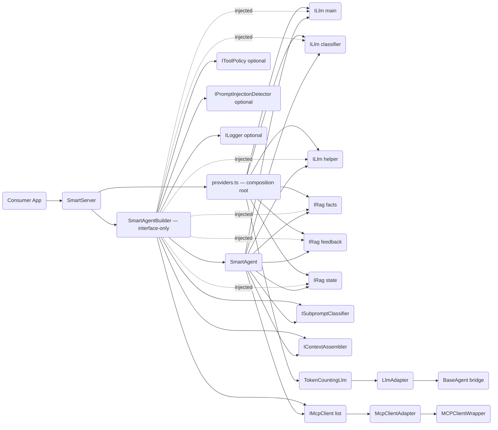
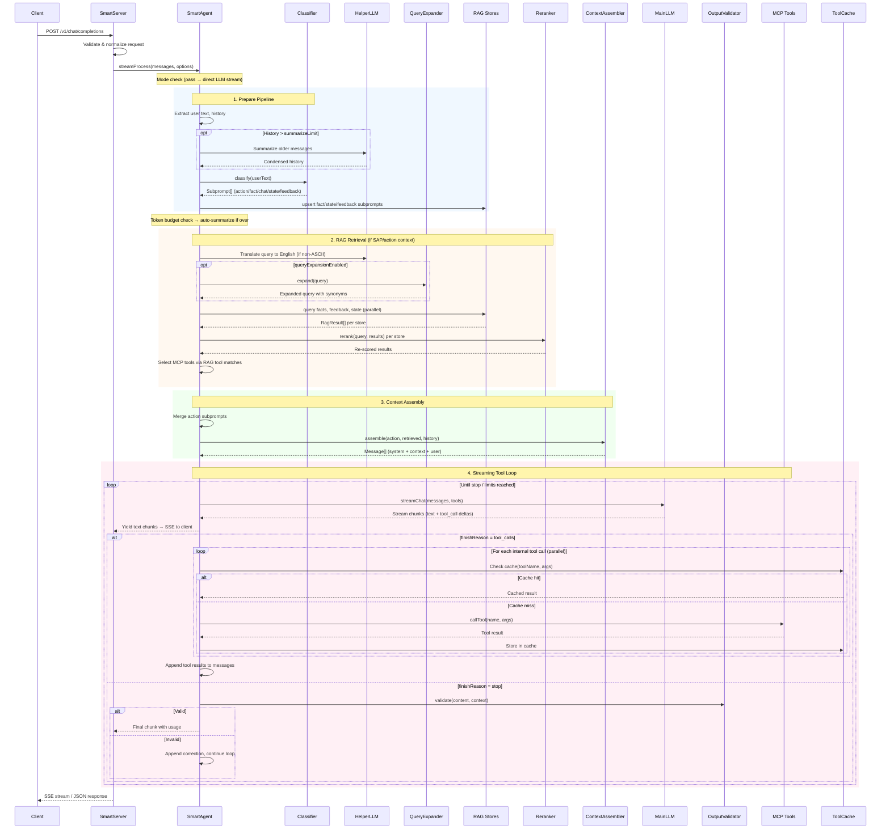

# Architecture

## Scope

`@mcp-abap-adt/llm-agent` currently contains two layers:

1. **Legacy core (`src/agents`, `src/llm-providers`, `src/mcp`)**
- Provider-specific agent implementations and direct MCP integration.
- Kept for backward compatibility and adapter reuse.

2. **Smart Agent stack (`src/smart-agent`)**
- Orchestrated pipeline with classification, RAG retrieval, policy checks, MCP execution loop, and OpenAI-compatible HTTP serving.
- This is the primary runtime architecture for new work.

## Runtime Topology (Smart Stack)

```text
Client (OpenAI-compatible)
  -> SmartServer (HTTP/SSE) — composition root
     -> providers.ts (resolves config → concrete ILlm, IRag, IEmbedder)
     -> SmartAgentBuilder (interface-only wiring, no provider knowledge)
        -> SmartAgent (orchestration loop)
           -> ILlm (main/helper/classifier via adapters)
           -> IRag stores (facts/feedback/state)
           -> IMcpClient[] (one or many MCP endpoints)
           -> Policy guards (tool policy + injection detector)
```

### Dependency Graph (Detailed)



## Embeddable Component Contract (No YAML)

For library embedding, YAML is not required. YAML is only a CLI/runtime convenience for `llm-agent`.

Primary embeddable surfaces:
- package export `@mcp-abap-adt/llm-agent/smart-server` -> `SmartServer`
- package export `@mcp-abap-adt/llm-agent/testing` -> deterministic test doubles for consumer integration tests

Minimal programmatic integration:

```ts
import { SmartServer } from '@mcp-abap-adt/llm-agent/smart-server';

const server = new SmartServer({
  llm: {
    apiKey: process.env.DEEPSEEK_API_KEY!,
    model: 'deepseek-chat',
  },
  mode: 'smart',
});

const handle = await server.start();
// handle.port, handle.getUsage(), handle.close()
```

`SmartServer` public contract:
- input: `SmartServerConfig`
- output: `Promise<SmartServerHandle>`
- lifecycle: `start()` -> `{ port, getUsage, close }`
- protocol: OpenAI-compatible `/v1/chat/completions` (JSON + SSE)

## Request Processing Flow



### Key decision points

1. **Mode selection** — `pass` skips the entire pipeline and streams directly from LLM. `smart` runs full orchestration. `hard` forces MCP-only tools (no external tools).
2. **SAP context detection** — If any action subprompt has `context: "sap-abap"` or mode is `hard`, RAG retrieval and MCP tool selection are triggered. Otherwise, only external tools are used.
3. **Tool routing** — Tool calls from LLM are classified as: internal (MCP), external (client-provided), hallucinated (unknown), or blocked (temporarily unavailable). Each category has distinct handling.
4. **Loop termination** — The tool loop exits on: `finishReason: stop`, `maxIterations` reached, `maxToolCalls` exhausted, abort signal, or external tool call delegation.

## Request Lifecycle

### 1. Server Boundary

Entry points:
- `src/smart-agent/smart-server.ts` (`SmartServer`)
- `src/smart-agent/server.ts` (`SmartAgentServer`, lightweight/legacy test server)

`SmartServer` responsibilities:
- Parse/validate OpenAI-compatible requests (`/v1/chat/completions`).
- Normalize message content blocks into text.
- Normalize external tool definitions with `normalizeExternalTools()`.
- Emit SSE chunks in OpenAI-compatible sequence.
- Build and hold `SmartAgent` via `SmartAgentBuilder`.

### 2. Orchestration Core

Main implementation:
- `src/smart-agent/agent.ts` (`SmartAgent`)

SmartAgent has two execution paths:

**Path A — Hardcoded flow** (default, when `pipeline.stages` is absent):

1. Pre-flight and timeout/abort merging.
2. Subprompt classification (`ISubpromptClassifier`).
3. Optional history summarization (helper LLM).
4. RAG retrieval for action subprompts (`facts/feedback/state`).
5. MCP tool catalog retrieval and tool selection.
6. Context assembly (`IContextAssembler`).
7. Streaming tool loop:
  - stream model output,
  - accumulate tool-call deltas,
  - execute internal MCP tools,
  - return external tool calls to caller,
  - enforce loop/tool limits.

**Path B — Structured pipeline** (when `pipeline.stages` is present):

1. Pre-flight and timeout/abort merging.
2. Build `PipelineContext` with all dependencies and mutable state.
3. `PipelineExecutor.executeStages()` walks the stage definition tree.
4. Each stage handler reads/writes `PipelineContext`.
5. The `tool-loop` handler streams via `ctx.yield()` callback.

See [Structured Pipeline DSL](#structured-pipeline-dsl) for details.

### 3. LLM Integration

Abstractions:
- `src/smart-agent/interfaces/llm.ts`
- `src/smart-agent/adapters/llm-adapter.ts`

`LlmAdapter` bridges legacy `BaseAgent` implementations to smart-agent `ILlm`.
Concrete provider resolution is centralized in:
- `src/smart-agent/providers.ts` — the only module that imports concrete LLM providers

Pipeline config types (`deepseek`, `openai`, `anthropic`, `sap-ai-sdk`) are defined in:
- `src/smart-agent/pipeline.ts` (types only, no provider logic)

### 4. RAG Layer

Core contracts:
- `src/smart-agent/interfaces/rag.ts` — `IEmbedder`, `IRag`, `EmbedderFactory`

Implementations:
- `src/smart-agent/rag/vector-rag.ts`
- `src/smart-agent/rag/in-memory-rag.ts`
- `src/smart-agent/rag/ollama-rag.ts`
- `src/smart-agent/rag/openai-embedder.ts`
- `src/smart-agent/rag/qdrant-rag.ts`
- `src/smart-agent/rag/embedder-factories.ts` — built-in embedder factories (`ollama`, `openai`)

Embedders are injectable via DI:
- Programmatic: `SmartServer({ embedder: myEmbedder })`
- YAML-driven: register custom factory via `SmartServer({ embedderFactories: { 'my-embedder': fn } })`, then reference in YAML as `embedder: my-embedder`

Stores are split by intent:
- `facts` (domain/tool knowledge)
- `feedback` (user guidance)
- `state` (session memory)

### 5. MCP Layer

- Smart stack uses `IMcpClient` abstraction.
- Default adapter wraps `MCPClientWrapper` from `src/mcp/client.ts`.
- Supports multiple MCP servers simultaneously via builder/pipeline config.

## Internal Interfaces and Default Implementations

| Interface | Role | Default implementation |
|---|---|---|
| `ILlm` | Chat/stream model abstraction used by `SmartAgent` | `TokenCountingLlm(LlmAdapter(BaseAgent))` via `providers.ts` |
| `IEmbedder` | Text → vector embedding | `OllamaEmbedder`, `OpenAiEmbedder`, or custom via DI |
| `ISubpromptClassifier` | Intent/subprompt decomposition | `LlmClassifier` |
| `IContextAssembler` | Builds final model context window | `ContextAssembler` |
| `IRag` (`facts/feedback/state`) | Retrieval and memory stores | `VectorRag`, `QdrantRag`, `OllamaRag`, or `InMemoryRag` |
| `IMcpClient` | Tool catalog and tool execution | `McpClientAdapter(MCPClientWrapper)` |
| `IToolPolicy` | Allow/deny policy checks | `ToolPolicyGuard` (optional) |
| `IPromptInjectionDetector` | Injection heuristics | `HeuristicInjectionDetector` (optional) |
| `ILogger` | Structured logging sink | `ConsoleLogger` / `SessionLogger` / injected custom logger |

### Separation of concerns

- **`SmartAgentBuilder`** (`src/smart-agent/builder.ts`) — interface-only factory. Accepts `ILlm`, `IRag`, `IMcpClient`, etc. Has no knowledge of concrete providers.
- **`providers.ts`** (`src/smart-agent/providers.ts`) — composition root. The only module that imports concrete LLM providers (`DeepSeek`, `OpenAI`, `Anthropic`, `SapCoreAI`) and RAG implementations (`OllamaRag`, `QdrantRag`, etc.). Resolves config → interface instances.
- **`SmartServer`** (`src/smart-agent/smart-server.ts`) — uses `providers.ts` to resolve config, then injects interfaces into `SmartAgentBuilder`.

## Execution Modes

Configured via `SmartAgentConfig.mode` and `SmartServerMode`:

- `smart`:
- Full orchestration (classification + RAG + MCP selection + tool loop).
- Uses external tools when SAP context is not required.

- `hard`:
- SAP/MCP-focused behavior with strict internal tool context.
- External tools are not active in MCP execution loop.

- `pass`:
- Pure passthrough to main LLM stream over provided history/tools.
- Skips orchestration stages.

## Protocol Contracts

### Streaming Tool Calls

`LlmStreamChunk.toolCalls` supports both finalized calls and deltas:
- `LlmToolCall`
- `LlmToolCallDelta`

Defined in:
- `src/smart-agent/interfaces/types.ts`

Normalization helpers:
- `src/smart-agent/utils/tool-call-deltas.ts`

This removes unsafe cast chains in critical stream paths and keeps delta assembly explicit.

### External Tool Input Contract

Incoming tool payloads are normalized at boundary:
- `src/smart-agent/utils/external-tools-normalizer.ts`

Accepted shapes:
- internal `LlmTool`
- OpenAI-compatible `{ type: 'function', function: { name, description, parameters } }`-like shape (name/function-derived)

Invalid tool shapes are dropped during normalization instead of flowing into runtime logic as opaque objects.
Validation mode is configurable at request boundary:
- `permissive` (default): invalid client tools are dropped and logged.
- `strict`: request is rejected with `400 invalid_request_error` and a validation code.

### Session Tool Availability Contract

Tools can be protocol-valid but temporarily unavailable in the current environment/session.

- Runtime-unavailable tools are temporarily blocked with TTL in a session-scoped registry.
- Blocked tools are excluded from subsequent LLM tool contexts within the session window.
- The agent emits diagnostics for both block events and blocked-tool interceptions.

## Legitimate vs Suspicious Edge Cases

Decision rule:
- **Legitimate**: allowed by upstream protocol/model behavior, must be handled for compatibility.
- **Suspicious**: produced by local contract gaps, cast-driven parsing, or unclear ownership.

### Legitimate (document + test)

- Fragmented SSE tool arguments across chunks.
- Separate usage tail chunk in SSE.
- Unknown/hallucinated tool names from the model.
- Transport-level MCP failures requiring reconnect/retry/fallback.
- Abort, max-iteration, and max-tool-call safety termination.

### Suspicious (refactor/tighten)

- Runtime dependence on `as unknown as ...` in protocol paths.
- Silent parse degradation without diagnostics.
- Heuristic acceptance of malformed boundary payloads.

Action policy:
- Legitimate -> keep behavior, encode as invariant, test it.
- Suspicious -> tighten contracts/DTOs/validators, add diagnostics, and simplify control flow.

## Key Modules

- `src/smart-agent/agent.ts`: orchestration loop and tool execution control.
- `src/smart-agent/smart-server.ts`: production OpenAI-compatible server.
- `src/smart-agent/builder.ts`: interface-only dependency wiring (no provider knowledge).
- `src/smart-agent/providers.ts`: composition root — concrete provider/embedder/RAG resolution.
- `src/smart-agent/pipeline.ts`: pipeline config types (types only, no logic).
- `src/smart-agent/context/context-assembler.ts`: final context construction.
- `src/smart-agent/classifier/llm-classifier.ts`: subprompt decomposition.
- `src/smart-agent/policy/*`: policy guard + injection detector.
- `src/mcp/client.ts`: transport implementation and resilience behavior.

## Repository Structure (High Level)

```text
src/
  agents/                  # legacy/provider-specific agent implementations
  llm-providers/           # provider clients (OpenAI/Anthropic/DeepSeek/SAP Core)
  mcp/                     # MCP transport client wrapper
  smart-agent/             # primary orchestrated architecture
    adapters/
    classifier/
    context/
    interfaces/
    llm/
    pipeline/              # structured YAML pipeline DSL
      handlers/            # built-in stage handler implementations
    policy/
    rag/
    utils/
    smart-server.ts
    agent.ts
    builder.ts             # interface-only factory
    providers.ts           # composition root (concrete providers)
    pipeline.ts            # pipeline config types
```

## Structured Pipeline DSL

The SmartAgent supports an optional structured YAML pipeline that replaces the hardcoded orchestration flow. When `pipeline.stages` is present in config, the `PipelineExecutor` walks a stage definition tree instead of running the default hardcoded sequence.

### Pipeline Architecture

```text
PipelineConfig (YAML / programmatic)
  → PipelineExecutor (tree walker)
    → IStageHandler implementations (one per stage type)
      → PipelineContext (shared mutable state bag)
```

Key components:
- **`PipelineExecutor`** (`src/smart-agent/pipeline/executor.ts`) — walks the stage tree, handles `parallel`/`repeat` control flow, evaluates `when` conditions, creates tracer spans.
- **`PipelineContext`** (`src/smart-agent/pipeline/context.ts`) — mutable state bag threaded through all stages. Contains immutable input, injected dependencies, mutable state (RAG results, tools, messages), and a `yield()` callback for streaming.
- **`IStageHandler`** (`src/smart-agent/pipeline/stage-handler.ts`) — single-method interface: `execute(ctx, config, span): Promise<boolean>`.
- **Condition evaluator** (`src/smart-agent/pipeline/condition-evaluator.ts`) — safe expression evaluator for `when`/`until` fields. Supports dot-path property access, negation, `&&`/`||`, comparisons. No `eval()`.

### Stage Types

**Built-in operations** — each has a handler in `src/smart-agent/pipeline/handlers/`:

| Stage type | Handler | Role |
|---|---|---|
| `classify` | `ClassifyHandler` | Decompose input into typed subprompts |
| `summarize` | `SummarizeHandler` | Condense history using helper LLM |
| `rag-upsert` | `RagUpsertHandler` | Upsert subprompts to RAG stores |
| `translate` | `TranslateHandler` | Translate non-ASCII query to English |
| `expand` | `ExpandHandler` | Expand query with synonyms |
| `rag-query` | `RagQueryHandler` | Query a single RAG store (`config.store`) |
| `rerank` | `RerankHandler` | Re-score RAG results |
| `tool-select` | `ToolSelectHandler` | Select MCP tools from RAG results |
| `assemble` | `AssembleHandler` | Build final LLM context |
| `tool-loop` | `ToolLoopHandler` | Streaming LLM + tool execution loop |

**Control flow** — orchestrate child stages:

| Type | Behavior |
|---|---|
| `parallel` | Run `stages` concurrently via `Promise.all`, then run `after` stages sequentially |
| `repeat` | Loop `stages` until `until` condition or `maxIterations` |

### Default Pipeline

`getDefaultStages()` returns a stage tree that matches the current hardcoded flow:

```text
classify → summarize → rag-upsert
  → rag-retrieval (parallel, when: shouldRetrieve):
      stages: [translate, expand]
      after: [rag-query×3 (parallel), rerank, tool-select]
  → assemble → tool-loop
```

### YAML Example

```yaml
pipeline:
  version: "1"
  stages:
    - id: classify
      type: classify
    - id: summarize
      type: summarize
    - id: rag-retrieval
      type: parallel
      when: "shouldRetrieve"
      stages:
        - { id: translate, type: translate }
        - { id: expand, type: expand }
      after:
        - id: rag-query
          type: parallel
          stages:
            - { id: rag-facts, type: rag-query, config: { store: facts, k: 10 } }
            - { id: rag-feedback, type: rag-query, config: { store: feedback, k: 5 } }
        - { id: rerank, type: rerank }
        - { id: tool-select, type: tool-select }
    - id: assemble
      type: assemble
    - id: tool-loop
      type: tool-loop
```

### Custom Stage Handlers

Consumers can register custom stage handlers via the builder:

```ts
import type { IStageHandler, PipelineContext } from '@mcp-abap-adt/llm-agent';

class AuditLogHandler implements IStageHandler {
  async execute(ctx: PipelineContext, config: Record<string, unknown>, span: ISpan): Promise<boolean> {
    console.log(`[audit] Processing: ${ctx.inputText.slice(0, 100)}`);
    return true; // continue pipeline
  }
}

builder.withStageHandler('audit-log', new AuditLogHandler());
```

Then reference in YAML:

```yaml
stages:
  - id: audit
    type: audit-log
  - id: classify
    type: classify
  # ...
```

### Backwards Compatibility

When `pipeline.stages` is absent from config, the hardcoded flow in `SmartAgent.streamProcess()` runs unchanged. The structured pipeline is opt-in only.

### Pipeline Files

```text
src/smart-agent/pipeline/
  types.ts              # StageDefinition, BuiltInStageType, ControlFlowType
  context.ts            # PipelineContext interface
  stage-handler.ts      # IStageHandler interface
  condition-evaluator.ts # Safe expression evaluator for when/until
  executor.ts           # PipelineExecutor — tree walker
  default-pipeline.ts   # getDefaultStages() — matches hardcoded flow
  handlers/
    index.ts            # buildDefaultHandlerRegistry() + re-exports
    classify.ts         # ClassifyHandler
    summarize.ts        # SummarizeHandler
    rag-upsert.ts       # RagUpsertHandler
    translate.ts        # TranslateHandler
    expand.ts           # ExpandHandler
    rag-query.ts        # RagQueryHandler
    rerank.ts           # RerankHandler
    tool-select.ts      # ToolSelectHandler
    assemble.ts         # AssembleHandler
    tool-loop.ts        # ToolLoopHandler
  index.ts              # Re-exports all pipeline types and classes
```

## Current Technical Debt (Explicit)

- No known outstanding technical debt. Aggregate metrics, circuit breakers, health checks, and config hot-reload have been implemented.
